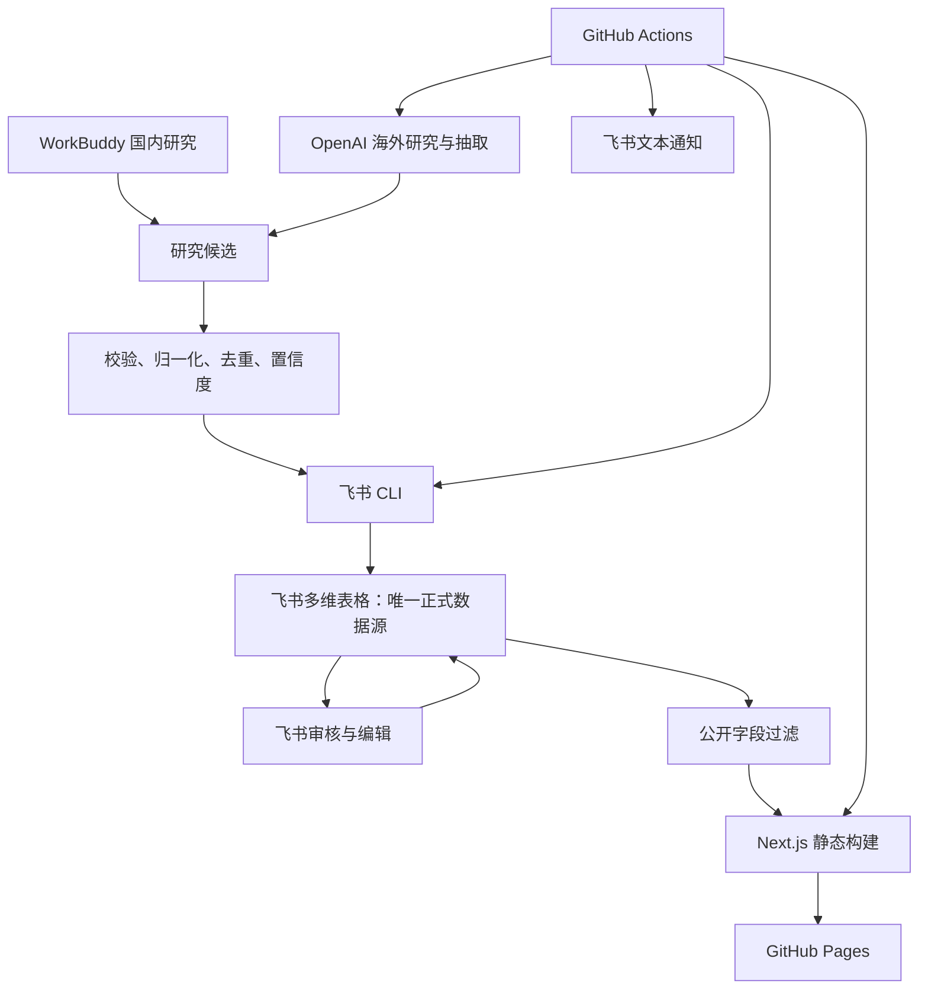

# 具身智能公司动态雷达 MVP 工程规格

> 版本：v0.2  
> 状态：Implementation contract  
> 更新日期：2026-07-31  
> 架构基线：`architecture.md`  
> 产品要求：`PRD.md`  
> 技术选型：`TECH-STACK.md`

架构组件、数据流、部署与安全边界以 `architecture.md` 为最高参考。本规格负责细化工程契约，不得改变其中的架构不变量。

## 1. 工程目标

本规格定义“飞书为唯一正式数据源、GitHub Actions 自动运行、GitHub Pages 托管静态网站”的实现契约。

Codex 是主工程和集成 Agent；Claude Code 仅做只读审核；WorkBuddy 是国内研究工具，不承担代码实现。

## 2. 系统边界

### 2.1 必须实现

- 飞书多维表格 Schema 与公司自建应用。
- 飞书 CLI。
- WorkBuddy 候选文件导入。
- OpenAI 海外候选发现、相关性、抽取、核验和摘要。
- 公司归一化、事件去重、来源、置信度和审核状态。
- 飞书候选审核、日报编辑和观察清单视图。
- 飞书文本通知。
- GitHub Actions 定时调度、幂等补跑和手动重试。
- Next.js 静态网站。
- GitHub Pages 自动部署。
- 90 天历史回填。

### 2.2 不实现

- PostgreSQL、Neon、Drizzle 或其他独立数据库。
- Cloudflare、Vercel 或常在线个人电脑。
- 独立管理后台和管理员账号系统。
- Obsidian、Coze、飞书消息卡片。
- 微信登录自动化或反爬绕过。
- 用户登录、评论、收藏和 CRM。

## 3. 高层架构

## 4. 仓库结构

建议目录：

- `app/`：Next.js 页面与布局。
- `components/`：共享 UI 和图表组件。
- `lib/domain/`：领域类型、规则和 Schema。
- `lib/feishu/`：飞书客户端、字段映射和 Repository。
- `lib/providers/`：OpenAI、WorkBuddy import 和通知 Provider。
- `lib/pipeline/`：发现、抽取、去重、日报和调度。
- `lib/publication/`：公开字段投影与静态页面数据。
- `cli/`：项目飞书 CLI。
- `scripts/`：GitHub Actions 使用的确定性入口。
- `tests/fixtures/`：脱敏 Fixture。
- `.agents/skills/`：项目级 Codex Skills。
- `.github/workflows/`：CI、调度和 Pages 发布。

依赖方向：

- UI 只依赖公开查询模型。
- 领域层不得依赖飞书 SDK、OpenAI SDK 或 Next.js。
- Provider 实现依赖领域契约。
- CLI 和 Actions 入口组合领域服务与 Provider。

## 5. 领域对象

### 5.1 ResearchCandidate

- `candidateId`
- `sourceUrl`
- `canonicalUrl`
- `title`
- `sourceName`
- `sourceType`
- `sourceTier`
- `regionScope`
- `discoveredBy`
- `publishedAt`
- `discoveredAt`
- `rawExcerpt`
- `relevance`
- `extractedFacts`
- `confidence`
- `duplicateOf`
- `conflicts`
- `reviewStatus`

### 5.2 FundingEvent

- `eventId`
- `companyId`
- `round`
- `amount`
- `currency`
- `amountDisclosed`
- `investors`
- `announcedAt`
- `region`
- `technologyTags`
- `publicSummary`
- `publicWhyItMatters`
- `sourceIds`
- `confidence`
- `importanceScore`
- `importanceReason`
- `publicationStatus`
- `isPublic`

### 5.3 CompanyDevelopment

- `developmentId`
- `companyId`
- `category`
- `title`
- `announcedAt`
- `technologyTags`
- `publicSummary`
- `publicWhyItMatters`
- `sourceIds`
- `confidence`
- `importanceScore`
- `importanceReason`
- `publicationStatus`
- `isPublic`

### 5.4 InformationSource

- `sourceId`
- `title`
- `url`
- `publisher`
- `sourceType`
- `sourceTier`
- `publishedAt`
- `isPrimary`
- `lastVerifiedAt`

### 5.5 Company

- `companyId`
- `nameZh`
- `nameEn`
- `aliases`
- `website`
- `region`
- `technologyTags`
- `publicDescription`

### 5.6 DailyDigest

- `digestId`
- `digestDate`
- `title`
- `fundingEventIds`
- `technologyProductDevelopmentIds`
- `commercializationDevelopmentIds`
- `sectionOrder`
- `reviewStatus`
- `publicationStatus`
- `publishedAt`
- `autoPublished`
- `correctionNote`

### 5.7 WatchItem

- `watchId`
- `type`
- `name`
- `queries`
- `region`
- `technologyTags`
- `priority`
- `enabled`

### 5.6 InternalAssessment

- `assessmentId`
- `companyId` 或 `eventId`
- `attentionLevel`
- `strategicAssessment`
- `followUpStatus`
- `owner`
- `internalNotes`

### 5.7 AutomationRun

- `runId`
- `businessDate`
- `jobType`
- `status`
- `attempt`
- `startedAt`
- `finishedAt`
- `errorCode`
- `errorSummary`
- `manualActionRequired`

## 6. 飞书多维表格契约

### 6.1 表

固定表名：

- `研究候选`
- `融资事件`
- `公司动态`
- `信息来源`
- `公司`
- `日报`
- `观察清单`
- `内部战投备注`
- `自动化任务`

生产逻辑使用字段 ID，不依赖可被人工修改的字段显示名。字段 ID 映射保存在服务端配置中。

### 6.2 身份与权限

- 使用公司飞书自建应用。
- 生产任务使用应用身份。
- 应用只获得指定多维表格及发送文本消息所需权限。
- 内部战投备注不授权给 WorkBuddy 或 OpenAI。
- 公开网站构建只使用公开投影。

### 6.3 Repository 规则

飞书 Repository 必须支持：

- 按稳定业务 ID 查询。
- 分页读取和批量写入。
- 幂等创建或更新。
- 乐观并发检查。
- 限流重试。
- 审计字段写入。
- 字段缺失或字段类型变化时快速失败。

飞书多维表格不提供与关系数据库相同的唯一约束，因此应用层必须在写入前查询并使用稳定业务 ID 防重。

## 7. 运行时 Schema

所有外部输入使用 Zod 校验。

### 7.1 URL

- 只允许 HTTP 和 HTTPS。
- 拒绝本机、私网、云元数据和凭据型 URL。
- canonical URL 去除已知追踪参数。
- 重定向后的最终 URL 重新校验。

### 7.2 文本

- 标题、摘要、正文片段和数组均设置长度上限。
- 删除脚本、危险 HTML 和不可见控制字符。
- 不保存无必要的完整原文。

### 7.3 金额

- 金额使用十进制字符串传递，禁止浮点计算。
- 未披露金额使用 `amountDisclosed=false`。
- 币种使用固定枚举。
- 原币金额保留；看板换算只用于展示统计。

### 7.4 时间

- 内部时间统一为 ISO 8601 UTC。
- 业务日报日期使用 Asia/Shanghai。
- 测试必须使用固定时钟。

## 8. Provider

### 8.1 OpenAIProvider

职责：

- 海外 Web Search。
- 相关性判断。
- 结构化抽取。
- 冲突比较。
- 中文摘要。
- 市场观察。

限制：

- 模型来自环境变量。
- 输出经过 Schema 校验。
- 有每日调用、候选、Token 和成本上限。
- 只返回候选或建议，不直接写飞书正式事件。

### 8.2 WorkBuddyImportProvider

输入为固定候选文件或标准输入，字段至少包括：

- 标题
- 来源 URL
- 来源名称
- 发布时间
- 查询词
- 初步摘要
- 发现时间

导入流程：

1. 验证文件大小和 Schema。
2. 校验 URL。
3. 生成候选 ID 和 canonical URL。
4. 去重。
5. 写入“研究候选”。

如果未来 WorkBuddy 提供企业 API，只替换 Provider 实现，不改变领域 Schema。

### 8.3 FeishuNotificationProvider

只发送：

- 08:00 审核提醒。
- 09:00 发布通知。
- 任务失败与恢复通知。

消息只私聊配置的个人 `open_id`，使用纯文本或普通富文本链接；不接受群聊 `chat_id`，不生成消息卡片。

### 8.4 Mock Provider

CI 和本地测试必须提供 OpenAI、WorkBuddy、飞书和通知 Mock。Mock 不访问外部网络。

## 9. 飞书 CLI

CLI 是人工操作、Codex 和 GitHub Actions 的统一入口。

必须提供以下业务命令：

- 检查飞书连接与字段映射。
- 初始化或验证多维表格 Schema。
- 导入 WorkBuddy 候选。
- 运行 OpenAI 候选发现。
- 处理候选相关性、抽取和去重。
- 列出待审核候选。
- 生成指定日期日报草稿。
- 验证指定日报可发布。
- 导出公开网站数据。
- 记录任务状态。
- 重试指定失败任务。

CLI 输出机器可读结果和简洁人类摘要；错误使用稳定错误码。任何命令都不得将密钥输出到日志。

## 10. 采集流水线

阶段：

1. `DISCOVER`
2. `VALIDATE`
3. `FETCH`
4. `CLASSIFY`
5. `EXTRACT`
6. `RESOLVE_COMPANY`
7. `DEDUPLICATE`
8. `SCORE_CONFIDENCE`
9. `SUMMARIZE`
10. `PERSIST_CANDIDATE`

规则：

- 阶段可重试且幂等。
- 单条候选失败不终止整批。
- 重试不得重复创建飞书记录。
- 相同 canonical URL 视为强重复信号。
- 公司、日期、轮次和金额相似时进入事件级去重。
- 冲突事实保留多个来源并标记待复核。

## 11. 审核与日报

### 11.1 审核状态

- `PENDING`
- `APPROVED`
- `REJECTED`
- `NEEDS_RESEARCH`
- `DUPLICATE`

### 11.2 发布状态

- `DRAFT`
- `READY`
- `PUBLISHED`
- `CORRECTED`
- `WITHDRAWN`

### 11.3 日报规则

- 每个业务日期最多一条日报。
- 条目只引用审核通过的融资事件或公司动态。
- 日报固定为“今日融资、技术与产品、商业化进展”三个板块。
- 每个板块默认按 1–5 重要性评分降序，人工调整的最终顺序优先。
- 每条内容必须关联并内联展示至少一个可访问原始来源；不得建立独立来源板块。
- 09:00 时未完成人工审核，可发布自动稿并设置 `autoPublished=true`。
- 更正更新当前公开内容并保留更正说明。
- 撤下内容不进入下一次网站构建。

## 12. 公开数据投影

网站构建不能直接导出整张飞书记录。

允许公开：

- 公司公开资料。
- 已发布融资事实。
- 已发布技术、产品和商业化动态。
- 公开摘要。
- 公开来源。
- 重要性评分与理由。
- 置信度。
- 日报和更正说明。
- 聚合统计。

禁止公开：

- 内部战投备注。
- 待审核或被拒绝候选。
- 操作人邮箱。
- 自动化错误详情。
- 飞书 record ID 和应用凭据。
- OpenAI 请求与完整响应。

构建前执行公开 DTO Schema 校验和敏感字段拒绝列表检查。

## 13. 静态网站

### 13.1 路由

- `/`
- `/daily/[date]`
- `/archive`
- `/funding/[eventId]`
- `/companies/[companyId]`
- `/dashboard`

### 13.2 构建

- Next.js 使用静态导出。
- 构建时读取经过公开投影的本地 JSON。
- 不在浏览器端调用飞书或 OpenAI。
- GitHub Pages 使用项目路径时，资源和链接必须支持 base path。
- 所有页面具备静态 404 降级。

### 13.3 历史归档

- 日报发布后进入归档。
- 按月份生成索引。
- 日期链接稳定。
- 只生成已发布、已更正状态页面。

### 13.4 看板

构建时生成聚合数据：

- 事件数量
- 披露金额
- 轮次
- 技术方向
- 地区

未披露金额计入事件数量，不计入金额总额。

## 14. GitHub Actions

### 14.1 CI

每次 Pull Request 执行：

- 代码规范检查。
- TypeScript 类型检查。
- 单元测试。
- 集成测试。
- Next.js 静态构建。
- 链接和敏感字段检查。
- Playwright Smoke Test。

CI 不调用真实外部服务。

### 14.2 调度

调度 Workflow 周期性运行，不只依赖 07:00、08:00、09:00 三个单点 Cron。

每次运行：

1. 读取 Asia/Shanghai 当前业务日期。
2. 查询“自动化任务”中应执行且未完成的任务。
3. 取得任务锁。
4. 运行任务。
5. 写回成功或失败。
6. 释放任务锁。

任务类型：

- `DISCOVER_OVERSEAS`
- `PROCESS_CANDIDATES`
- `CREATE_REVIEW_DIGEST`
- `PUBLISH_DIGEST`
- `BUILD_SITE`
- `NOTIFY`
- `BACKFILL`

必须支持 `workflow_dispatch` 手动重试。

### 14.3 Pages 发布

- 只有默认分支允许生产发布。
- 发布 Job 只获得仓库读取、Pages 写入和身份令牌所需权限。
- 构建产物通过 GitHub Pages artifact 发布。
- 发布失败不得改变飞书正式数据。
- 上一个成功版本继续可访问。

## 15. 项目级 Codex Skill

仓库包含“日报网站发布”Skill，用于 Codex重复执行：

1. 检查飞书字段映射。
2. 导出公开数据。
3. 运行公开 DTO 和敏感字段验证。
4. 生成静态网站。
5. 运行测试和链接检查。
6. 汇报变更。
7. 经用户明确要求后提交、推送和触发发布。

Skill 负责标准化人工和维护流程；GitHub Actions 运行确定性 CLI 与脚本，不依赖交互式 Codex 会话。

## 16. 环境变量

分类：

- 飞书应用 ID、应用密钥和多维表格标识。
- 飞书各表 ID 和字段映射。
- OpenAI API Key、模型和预算限制。
- 飞书通知 Webhook 或应用消息配置。
- 应用时区和站点 base path。

规则：

- 生产值存储在 GitHub Secrets。
- PR Workflow 不获得生产 Secrets。
- 本地值保存在被 Git 忽略的环境文件。
- 任何环境变量不得写入静态产物。

## 17. 测试

### 17.1 单元测试

- Schema 合法与非法输入。
- URL 安全。
- 公司归一化。
- 事件去重。
- 置信度。
- 金额统计。
- 公开字段投影。
- 时间窗口与幂等键。

### 17.2 集成测试

- Mock WorkBuddy 导入到 Mock 飞书。
- Mock OpenAI 候选进入候选表。
- 审核状态生成日报。
- 飞书字段变化时快速失败。
- 公开导出不包含内部字段。
- 重试不重复写入。

### 17.3 E2E

- 首页展示最新日报。
- 日报、归档和融资详情互相导航。
- 未审核自动发布标记正确。
- 更正说明正确。
- 看板统计与 Fixture 一致。
- GitHub Pages base path 下资源可加载。

## 18. 可观测性

“自动化任务”表记录：

- 业务日期
- 任务类型
- 状态
- 尝试次数
- 候选数量
- 重复数量
- Schema 失败数量
- OpenAI调用量和估算成本
- 开始、结束和简化错误

日志只保存必要元数据，不保存密钥、完整原文、完整模型响应或内部判断。

## 19. 公司所有权

- GitHub 仓库必须属于公司 Organization。
- OpenAI Project 必须属于公司。
- 飞书应用和多维表格必须属于公司租户。
- WorkBuddy账号必须可移交。
- 至少两名管理员具有恢复权限。
- 操作手册包含密钥轮换、手动补跑和网站重新发布。

## 20. Definition of Done

单个任务完成必须满足：

- 实现范围与冻结契约一致。
- 新行为有自动化测试。
- 受影响测试全部通过。
- 没有真实密钥或内部数据进入 Git。
- 没有降低断言或跳过失败测试。
- 文档和字段映射同步更新。
- 交接包含结果、文件、验证和已知限制。

MVP 完成必须满足：

- 飞书能够完成审核和日报管理。
- 海外自动研究与国内候选导入可运行。
- GitHub Actions 可补跑和手动重试。
- GitHub Pages 可公开访问。
- 网站数据完全来自飞书公开投影。
- 内部字段泄露测试通过。
- 90 天回填完成或有可恢复进度。
- 公司其他管理员可独立完成一次发布。
