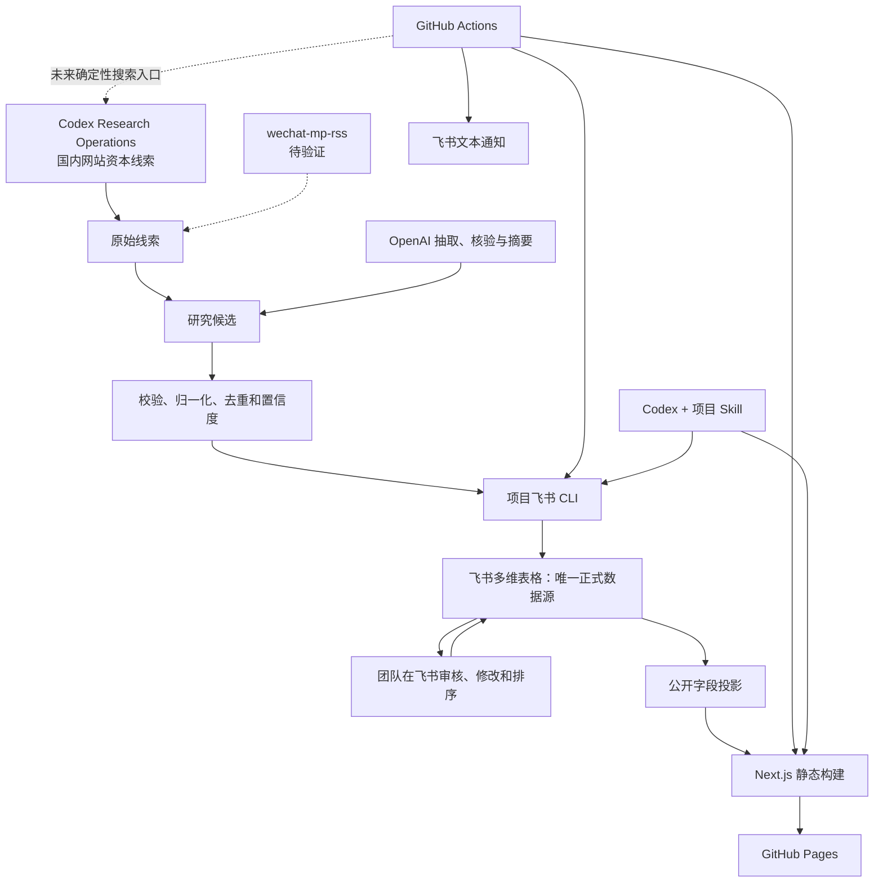

# 具身智能公司动态雷达 MVP 技术选型

> 版本：v0.3
> 状态：Accepted for MVP  
> 更新日期：2026-08-04
> 架构基线：`architecture.md`  
> 相关文档：`PRD.md`、`SPEC.md`

技术选择必须服从 `architecture.md` 中的组件职责、数据流和架构不变量。

## 1. 最终技术栈

| 层级 | 选择 |
|---|---|
| 唯一正式数据源 | 飞书多维表格 |
| 数据操作 | 飞书 OpenAPI + 官方 Node.js SDK |
| 项目操作入口 | TypeScript 飞书 CLI |
| 国内搜索 | Codex Research Operations + Agent Reach + 公开网站 |
| 公众号补充 | wechat-mp-rss，尚未验证，不是当前依赖 |
| 海外搜索 | 当前暂停；未来由 Codex Research Operations 执行 |
| AI 处理 | OpenAI Responses API |
| Web 框架 | Next.js App Router + TypeScript |
| 网站模式 | Next.js 静态导出 |
| UI | Tailwind CSS + shadcn/ui |
| 图表 | Apache ECharts |
| 代码托管 | 公司 GitHub Organization |
| 自动化 | GitHub Actions |
| 网站托管 | GitHub Pages |
| 通知 | 飞书个人私聊文本消息与普通链接 |
| 运行时校验 | Zod |
| 测试 | Vitest + Playwright |
| 包管理 | pnpm |
| 主工程 Agent | Codex |
| 独立审核 | Claude Code，只读 |

不使用：

- Cloudflare
- Vercel
- Neon、PostgreSQL 或其他独立数据库
- Drizzle 或 Prisma
- 独立管理后台
- 常在线个人电脑
- Obsidian
- Coze

## 2. 架构

## 3. 为什么采用这个方案

### 3.1 减少平台数量

只依赖公司已有或必要的三个平台：

- 飞书：数据、审核和通知。
- OpenAI：候选后的 AI 处理。
- GitHub：代码、自动化和网站托管。

WorkBuddy 已暂停；既有导入器仅作为历史兼容入口。

### 3.2 避免个人单点

- 自动任务运行在 GitHub 托管 Runner。
- 数据属于公司飞书租户。
- 代码属于公司 GitHub Organization。
- OpenAI Project 使用公司身份和支付方式。
- 不要求任何员工电脑持续开机。

### 3.3 网站仍可持续更新

每次发布从飞书读取审核后的公开数据，生成纯静态 HTML 并部署到 GitHub Pages。正式数据不复制到另一套数据库；构建产物可以随时重建。

## 4. 飞书多维表格

### 4.1 定位

飞书多维表格同时承担：

- 正式结构化数据。
- 内部 CMS。
- 审核和编辑界面。
- 观察清单。
- 运行状态面板。
- 基础内部仪表盘。

### 4.2 接入方式

使用公司自建应用和飞书 OpenAPI。

项目不把飞书官方开发者 CLI 当作业务数据 CLI。官方 CLI 主要用于飞书应用项目的创建、预览和上传；本项目另外实现轻量业务 CLI，内部调用飞书 SDK。

### 4.3 数据一致性

由于多维表格不是传统关系数据库：

- 每条记录使用应用生成的稳定业务 ID。
- 写入前按业务 ID 和 canonical URL 防重。
- 更新使用版本或更新时间做乐观并发检查。
- 多步操作写入任务状态，失败后幂等补偿。
- 字段映射使用字段 ID。
- 定期导出结构化备份。

## 5. 飞书 CLI

选择 TypeScript：

- 与 Next.js 和领域类型共享代码。
- 官方 Node.js SDK 支持良好。
- Zod 可复用。
- GitHub Actions 运行方便。

CLI 面向三类调用者：

- Codex 进行开发、维护和人工发布。
- GitHub Actions 执行自动任务。
- 管理员进行诊断、补跑和重新发布。

CLI 不负责交互式飞书页面；审核仍在多维表格中完成。

## 6. OpenAI

### 6.1 用途

- 候选相关性、事实抽取与必要核验。
- 公司与融资字段抽取。
- 多来源冲突比较。
- 中文摘要。
- 为周报生成候选摘要；每条公开内容内联原始来源。

### 6.2 接入

- 使用公司 OpenAI API Project。
- API Key 存储在 GitHub Secrets。
- 模型名通过环境变量配置。
- 所有响应通过 Zod 校验。
- PR 和测试环境只使用 Mock。

### 6.3 成本保护

- 每日查询上限。
- 每次候选数量上限。
- 单篇内容长度上限。
- 自动重试上限。
- 单日和月度预算告警。
- 在飞书自动化任务表中记录估算成本。

## 7. 搜索执行与兼容入口

当前国内搜索由 Codex Research Operations 执行，使用 Agent Reach 的可用网页搜索/阅读后端、站内公开搜索与原站公开 HTML。执行前运行 `agent-reach doctor --json`，记录能力状态和访问限制。

不直接爬取微信公众号。wechat-mp-rss 仅作尚未验证的补充；在确认稳定性、频控、条目日期和链接可访问性前，不进入生产完成标准。

WorkBuddy 与 `workbuddy-import` 保留为兼容能力，不再承担现行搜索职责。

搜索定时化只有在公司可交接的运行环境中，能够无个人登录态地运行确定性入口、访问公开网站并记录审计结果时，才进入生产 SLA。Codex 桌面定时任务可用于试验，不能单独满足该条件。

## 8. Next.js 静态网站

### 8.1 选择 Next.js

- 支持首页、动态路由式静态页面和共享组件。
- 适合周报、归档、融资详情和数据看板。
- Codex 和团队维护成本低。
- 后续需要动态功能时有升级空间。

### 8.2 静态导出约束

- 不使用依赖常驻服务器的 Route Handler。
- 不使用服务端 Session。
- 不在浏览器端读取飞书。
- 所有动态路由在构建时生成。
- 允许浏览器端链接、导航、筛选、排序、展开收起和图表切换；静态导出不等于无交互。
- 资源路径支持 GitHub Pages 项目 base path。
- 图片使用兼容静态导出的策略。

### 8.3 数据输入

构建前由 CLI 生成经过校验的公开 JSON：

- 最新周报。
- 历史周报索引。
- 融资事件、公司动态与逐条原始来源。
- 公司公开资料。
- 看板聚合。

公开 JSON 是临时构建输入或 artifact，不是正式数据源。

## 9. GitHub Actions

### 9.1 CI

负责：

- 安装依赖。
- Lint。
- TypeScript。
- 单元与集成测试。
- 静态构建。
- 敏感字段扫描。
- 链接检查。
- Playwright Smoke Test。

### 9.2 定时自动化

GitHub Scheduled Workflows 可能延迟，因此采用周期检查：

- 每隔固定时间检查飞书自动化任务表。
- 对已到时间且未完成的任务加锁执行。
- 每个业务日期和任务类型只有一个幂等键。
- 失败记录尝试次数。
- 支持手动触发补跑。

### 9.3 Secrets

生产 Secrets：

- 飞书应用凭据。
- 飞书多维表格和表 ID。
- OpenAI API Key。
- 飞书通知凭据。

Pull Request 来自不可信分支时不得获得生产 Secrets。

## 10. GitHub Pages

GitHub Pages 只负责：

- 接收静态网站 artifact。
- 托管 HTML、CSS、JavaScript 和公开 JSON。
- 提供 HTTPS 公开链接。
- 在新版本发布后切换到最新构建。

GitHub Pages 不负责：

- 保存正式融资数据。
- 调用 OpenAI。
- 审核。
- 定时采集。
- 保存内部备注。

发布失败时，上一个成功版本继续可用。

## 11. Codex Skill

目标是创建仓库级“资本动态周报网站发布”Skill；既有日报发布能力在迁移完成前保留：

- 发布步骤。
- 字段映射检查。
- 公开数据导出。
- 静态网站生成。
- 测试和安全检查。
- 交接格式。

Codex可以显式调用 Skill 完成人工更新或维护。GitHub Actions不依赖交互式 Skill，而是运行 Skill 所维护的确定性 CLI 和脚本。

## 12. 飞书通知

MVP 只发：

- 每日搜索清洗完成后的人工核验提醒与飞书视图链接。
- 次周一人工确认后的周报摘要与网站链接。
- 失败、恢复和人工重试提醒。

MVP 只私聊配置的个人 `open_id`，不发送群聊或消息卡片。发送失败不回滚飞书数据或网站发布。

## 13. 测试

### 13.1 Vitest

- 领域规则。
- Schema。
- URL 安全。
- 去重。
- 置信度。
- 公开字段过滤。
- 金额统计。
- 调度和幂等。
- 飞书和 OpenAI Mock。

### 13.2 Playwright

- 首页。
- 日报。
- 归档。
- 融资详情。
- 数据看板。
- GitHub Pages base path。
- 404。
- 移动端基础布局。

### 13.3 生产 Smoke Test

- 飞书连接。
- OpenAI受控查询。
- 飞书审核视图。
- 公开导出。
- Pages 发布。
- 飞书通知。

## 14. 本地开发

没有真实凭据时必须能够：

- 使用 Fixture 作为飞书数据。
- 使用 Mock OpenAI。
- 使用 Mock WorkBuddy 导入。
- 使用 Mock 通知。
- 生成完整静态网站。
- 运行全部测试。

真实凭据只用于明确的集成测试和生产任务。

## 15. 备份与恢复

- 定期将飞书正式表导出为受保护的结构化备份。
- 备份不得发布到 Pages。
- 记录字段 Schema 版本。
- 网站可以从飞书重新生成。
- 代码和发布历史由 GitHub 保存。
- 操作手册描述飞书凭据轮换、任务补跑和 Pages 重新发布。

## 16. 账号与费用

必需：

- 公司飞书租户和自建应用。
- 公司 OpenAI API Project。
- 公司 GitHub Organization 或可由公司多人管理的仓库。
- 公司可交接的 Codex 搜索运行环境。

可能费用：

- OpenAI API 用量。
- GitHub现有套餐或 Actions 用量。
- Agent Reach 所需搜索后端的合规额度（如适用）。
- 可选域名。

上线前按公司现有套餐重新核对配额和商业使用条件。

## 17. 实施顺序

1. 建立公司 GitHub 仓库和权限。
2. 创建飞书自建应用与多维表格。
3. 冻结领域 Schema 和字段 ID 映射。
4. 实现飞书 Repository 与 CLI。
5. 实现 Mock Provider 和测试。
6. 保留兼容候选导入，实现 Codex 国内媒体网站资本线索任务。
7. 实现 OpenAI 候选处理；海外发现保持暂停。
8. 实现候选清洗、事件去重、人工核验与周报迁移。
9. 实现 Next.js 静态网站。
10. 实现公开字段导出。
11. 配置 CI。
12. 配置 GitHub Actions 周期调度。
13. 配置 GitHub Pages。
14. 配置飞书文本通知。
15. 执行 90 天回填。
16. 七天试运行和公司交接演练。

## 18. 决策摘要

> 飞书多维表格是唯一正式数据源和内部审核后台；Codex Research Operations 搜索国内媒体网站资本线索，海外当前暂停；OpenAI完成候选后的抽取、核验与摘要；项目飞书 CLI 提供统一安全读写入口；Next.js 将飞书公开投影生成静态 HTML；GitHub Actions 运行确定性任务和补跑；GitHub Pages 托管新闻网站；Codex负责实现和维护，Claude Code只做只读审核。
