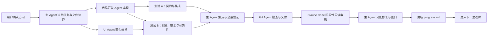

# Agent 协作与职责说明

> 版本：v0.3
> 状态：生效  
> 更新日期：2026-08-04
> 架构基线：`architecture.md`  
> 产品基线：`PRD.md`

## 1. 当前共同目标

团队正在实现一个具身智能融资情报系统：

1. Codex Research Operations 按 `search-strategy.md` 和国内网站清单发现融资与广义资本原始线索；海外当前暂停。
2. OpenAI负责候选后的相关性判断、结构化抽取、冲突核验和中文摘要；WorkBuddy 与既有海外发现入口只保留兼容能力。
3. 项目领域流水线校验、归一化、去重并计算置信度。
4. 飞书多维表格保存全部正式数据，并承担审核、编辑和排序。
5. Next.js 根据飞书公开投影生成静态 HTML。
6. GitHub Actions执行定时任务、补跑、构建和发布。
7. GitHub Pages托管公开新闻网站。

当前已完成工程骨架、领域契约、候选处理和既有日报基础能力；目标已改为每日搜索、人工核验和次周一周报，日报契约仍待迁移。

## 2. 协作原则

1. `architecture.md` 是组件、数据流、部署、安全边界和架构不变量的最高参考。
2. `PRD.md` 定义产品范围和用户价值。
3. 主 Agent 是唯一任务编排者和最终集成负责人。
4. 开发、Git、每日搜索、测试和 UI 由边界明确的专职子 Agent 执行。
5. Research Operations 是搜索执行角色；OpenAI 是处理 Provider；WorkBuddy 已暂停。
6. GitHub Actions是确定性自动化执行器，不自主改变业务规则。
7. 人类团队拥有事实审核、公开决策和内部战投判断的最终权力。
8. 外部 Agent只能创建候选或建议，不能直接发布或修改内部数据。
9. 任何 Agent完成重大功能后都必须确保 `progress.md` 已更新。
10. 日常调度、人工升级、文件权限和 Token 控制统一遵守 `docs/agent-working-agreement.md`。
11. 六个子 Agent 是按需启用的能力池；小任务默认使用一个执行 Agent，只在风险需要时增加一个独立 QA。

## 3. 角色与职责

### 3.1 主 Agent：Orchestrator / Tech Lead

主 Agent 负责：

- 维护架构和产品需求的一致性。
- 冻结领域类型、运行时 Schema、公开 DTO 和飞书字段映射。
- 把实施计划拆成单一可验证任务，指定文件边界、依赖和验收标准。
- 只向一个代码开发 Agent 授予实现任务，避免多个开发者同时修改共享契约。
- 组织两条独立测试线、UI 验收、Git 交付和生产验收。
- 复现和处理 Claude Code审核意见。
- 完成重大功能后更新 `progress.md`。

主 Agent 原则上不与子 Agent 同时修改业务代码；只在集成冲突、紧急修复或共享契约必须统一时直接修改。主 Agent 对最终集成结果、测试状态和交接完整性负责。

### 3.2 代码开发 Agent：Implementation Engineer

唯一的主力代码实现者，负责 CLI、领域流水线、Provider、公开投影、自动化脚本和网站逻辑。必须在分配的文件范围内工作，为新行为增加测试，不执行 commit、push、merge 或发布。

### 3.3 Git 管理 Agent：Release Manager

唯一默认有权执行分支、暂存、commit、rebase、push 和 PR 操作的子 Agent。它先核对工作树、测试证据和变更范围，不修改业务逻辑，不自行解决产品或架构分歧。所有不可逆、对外可见或生产发布动作仍需用户明确授权。

### 3.4 每日搜索管理 Agent：Research Operations

以 `search-strategy.md` 为执行基线，维护国内媒体网站清单和资本事件词，执行 Codex 网站搜索并记录覆盖、实际渠道或 Skill、空结果、失败、原始线索数、审核结果和来源表现。海外当前暂停，未来恢复后仍由该角色执行。

Research Operations 必须遵守：

- 当前优先逐站搜索清单内专业财经、科技和产业媒体；不直接爬取微信公众号。
- wechat-mp-rss 尚未验证，只能补充已产生的可访问条目，不能替代网站覆盖。
- 不恢复公司或赛道的每日/每周定点轮询，也不展开全量查询矩阵。
- 发现线索后再围绕公司、事件参与方、工商信息和产品资料做定向补充。
- 每条候选必须保留可访问网址；可信媒体报道可进入候选，不强制先找公司官方原文。
- 只能创建候选或搜索建议，不能批准、发布、修改正式事件或读取内部战投备注。

### 3.5 测试 Agent A：Contract & Integration QA

负责领域契约、Schema、Provider Adapter、飞书 Repository、幂等、重试和公开数据隔离测试。优先构造失败路径和回归用例，不修改生产实现来让测试通过。

### 3.6 测试 Agent B：E2E, Security & Reliability QA

负责网站 E2E、base path、链接、移动端、敏感字段扫描、定时任务恢复、构建产物和发布 smoke test。与测试 Agent A 使用不同视角和验收清单，不重复代码开发 Agent 的自测结论。

### 3.7 UI 设计 Agent：Product Designer

负责信息架构、设计 token、组件规格、页面状态、响应式、可访问性和视觉验收。默认交付设计规格和审查意见；只在主 Agent 明确分配独立 UI 文件时修改样式或组件。

### 3.8 Claude Code：阶段性独立只读审核

Claude Code只在功能已经完成基础测试后介入，审核：

- 公开与内部数据隔离。
- 飞书权限和密钥处理。
- 外部输入安全。
- 幂等、重试和并发。
- 错误处理和恢复。
- 边界条件。
- 测试覆盖缺口。

Claude Code不得：

- 领取常规实现任务。
- 修改核心领域契约。
- 修改飞书字段映射。
- 修改生产 GitHub Actions Workflow。
- 执行数据库或数据迁移。
- 合并、推送或发布。

审核意见必须包含文件位置、复现条件、影响和优先级。Codex负责复现、修复和回归验证。

### 3.9 WorkBuddy：暂停的兼容工具

WorkBuddy 当前不启动。以下能力仅说明历史兼容范围，不是现行任务：

- FA、VC/CVC、投资机构和专业媒体发布的国内融资、并购与资本动态。
- 微信公众号、公开网页、公司公告、投资方和 FA 稿件。
- 国内技术、产品、开源、订单、交付、部署、量产和产线等商业化动态。
- 宽科技候选，并为 Physical AI、具身智能及其上下游标记排序优先级。

WorkBuddy输出固定格式的研究候选，通过项目飞书 CLI进入候选层。

WorkBuddy不得：

- 直接创建正式融资事件。
- 修改审核状态或发布状态。
- 读取或修改内部战投备注。
- 发布日报或网站。
- 修改项目代码和架构。

如果 WorkBuddy只有个人客户端，则不承担无人值守生产 SLA。只有确认公司级 API、统一身份和可交接运行环境后，才允许进入自动调度。

### 3.10 OpenAI：内容处理 Provider

OpenAI负责候选后的相关性、抽取、冲突核验和摘要。海外搜索当前暂停；未来发现工作由 Research Operations 执行。

- 海外公司官网和投资机构公告搜索。
- 英文商业、科技和机器人媒体搜索。
- 监管披露搜索。
- 行业相关性判断。
- 融资事实抽取。
- 多来源冲突比较。
- 中文摘要和市场观察。

OpenAI输出必须通过固定 Schema、URL、安全、长度和证据校验。

OpenAI不得：

- 直接写入正式融资事件。
- 决定是否允许公开。
- 读取内部战投备注。
- 绕过人工审核和公开字段投影。

### 3.11 GitHub Actions：自动化执行器

GitHub Actions负责运行已经冻结的 CLI 和脚本：

- 周期调度。
- 已冻结的候选处理任务。
- 候选处理。
- 审核稿和周报生成；迁移前兼容既有日报实现。
- 失败补跑。
- 公开数据导出。
- Next.js 静态构建。
- GitHub Pages发布。
- 飞书文本通知。

GitHub Actions不得：

- 自主修改业务规则。
- 运行交互式 Codex会话作为生产依赖。
- 将生产 Secrets提供给不可信 Pull Request。
- 在发布失败时修改飞书正式数据。

### 3.12 人类产品与战投团队

人类团队负责：

- 确认产品范围和架构变更。
- 审核融资候选。
- 修正公司、轮次、金额、投资方和日期。
- 处理来源冲突。
- 决定是否允许公开。
- 调整日报排序。
- 填写内部战投判断和跟进状态。
- 管理公司账号、权限和生产密钥。

飞书中的正式审核结果是发布决策依据。

### 3.13 其他临时辅助 Agent

只有用户或主 Agent 明确需要额外专业能力时，才可在固定六个子 Agent 之外临时分配：

- Fixture 和 Mock。
- 独立单元测试。
- 独立页面和组件。
- 链接检查。
- 响应式和可访问性测试。
- 飞书字段清单核对。
- 文档一致性检查。

辅助 Agent不得自行修改：

- `architecture.md`
- 核心领域类型
- 公共 Zod Schema
- 飞书字段映射
- 公开 DTO
- 环境变量和 Secrets 名称
- 生产 GitHub Actions Workflow

这些共享契约由主 Agent 统一修改和集成。

## 4. 标准协作流程

Claude Code只在重大功能或阶段性交付后介入，不为每个微小任务制造额外阻塞。

## 5. 当前实施顺序

### 阶段一：工程和契约

- Next.js、TypeScript、测试和目录骨架。
- 领域类型。
- Zod Schema。
- 环境配置。
- Fixture 和 Mock。

### 阶段二：飞书数据层

- 多维表格和字段设计。
- 公司飞书自建应用。
- 飞书客户端。
- 字段映射。
- Repository。
- 项目飞书 CLI。

### 阶段三：研究与候选处理

- WorkBuddy候选格式与导入。
- OpenAI Provider。
- 内容安全。
- 相关性、抽取、归一化、去重、置信度和摘要。

### 阶段四：审核、周报和网站

- 飞书审核视图。
- 审核转正式事件。
- 周报和通知。
- 公开字段投影。
- 首页、周报、归档、融资详情、公司档案和数据看板。

### 阶段五：自动化和上线

- CI。
- 自动化任务状态机。
- GitHub Actions周期调度。
- GitHub Pages发布。
- 备份、回填、试运行、审核和交接。

具体任务编号、依赖和验证要求以 `implementation-plan.md` 为准。

## 6. 文件所有权

每个任务开始前必须声明允许修改的文件。

### Codex统一维护

- `architecture.md`
- `PRD.md`
- `SPEC.md`
- `TECH-STACK.md`
- `AGENTS.md`
- `agent-coordination.md`
- `search-strategy.md`
- `main-agent-handoff.md`
- 核心领域契约
- 飞书字段映射
- 公开 DTO
- 环境变量定义
- 生产 GitHub Actions Workflow

### 可按任务独立修改

- 明确分配的页面和组件。
- 对应页面测试。
- 独立 Fixture。
- 独立 Mock。
- 非共享工具。
- 明确指定的文档章节。

共享文件需要修改时，辅助 Agent先向 Codex说明原因，不得直接扩大范围。

## 7. 任务分配格式

Codex给其他开发 Agent分配任务时必须说明：

- 任务编号。
- 目标。
- 开始前必须阅读的文件。
- 允许修改的文件。
- 禁止修改的文件。
- 输入和冻结契约。
- 必须交付的结果。
- 必须新增或更新的测试。
- 验收标准。

分配搜索或候选处理任务时，必须将 `search-strategy.md` 列为必读输入；国内网站搜索还必须列出 `domestic-website-search-list.md` 和日期化任务单。只有兼容候选导入任务才读取 `docs/workbuddy-candidate-format.md`。

缺少文件边界或验收测试的任务不得开始。

任务单还必须标明 `docs/agent-working-agreement.md` 中的人工升级触发条件。子 Agent 遇到日期或事实冲突、登录/付费墙、两轮合理尝试仍无法确认，或继续深挖成本明显高于人工核验时，必须停止无边界搜索并交由主 Agent 询问用户。

## 8. 交接格式

每个开发 Agent完成任务后必须报告：

- 任务编号和完成结论。
- 修改的文件。
- 是否改变公共契约。
- 新增或更新的测试。
- 实际验证结果。
- 已知限制。
- 后续建议。
- 是否需要 Codex集成。
- 是否需要 Claude Code审核。
- 是否需要用户决策或授权。

子 Agent 默认不更新 `progress.md` 或 `main-agent-handoff.md`；这两个共享状态文档由主 Agent 在形成集成结论后统一更新。

## 9. 冲突和阻塞处理

### 9.1 架构冲突

停止实现，记录冲突，交由用户确认。不得自行改变 `architecture.md` 的不变量。

### 9.2 产品范围冲突

以 `PRD.md` 为准；需要扩大或缩小范围时请求用户确认。

### 9.3 工程契约冲突

Codex根据 `SPEC.md` 统一处理，并同步所有受影响的 Schema、Fixture、测试和文档。

### 9.4 文件冲突

停止修改共享文件，保留其他人的工作，由 Codex统一整合。

### 9.5 外部平台阻塞

先使用 Mock、Fixture 和 Adapter 继续开发，不使用个人账号或未授权替代方案绕过公司权限。

## 10. Progress 更新

完成以下事项后必须更新 `progress.md`：

- 一个重大功能。
- 一个实施阶段。
- 一个冻结契约。
- 一次正式集成。
- 一次重大缺陷修复。
- 一次真实 Provider 验证。
- 一次上线、回滚或交接演练。

进度记录至少说明：

- 日期。
- 完成内容。
- 验证结果。
- 已知限制或下一步。

没有完成必要测试或没有更新进度的重大功能，不得标记为完成。

## 11. 当前统一结论

- Codex主导工程实现和集成。
- Claude Code只做重大功能后的只读审核。
- Codex Research Operations 负责国内网站资本线索；海外当前暂停，未来也由该角色负责。
- OpenAI负责候选后的 AI 处理；WorkBuddy 仅保留兼容入口。
- GitHub Actions负责确定性自动执行。
- 飞书多维表格是唯一正式数据源和审核后台。
- 人类团队拥有事实审核、公开和内部判断的最终决定权。
- GitHub Pages只托管经过公开字段过滤的静态网站。
- `search-strategy.md` 是当前搜索执行基线：宽召回、线索触发补搜、必须保留网址、Physical AI 优先排序、不做公司或赛道定点轮询。
