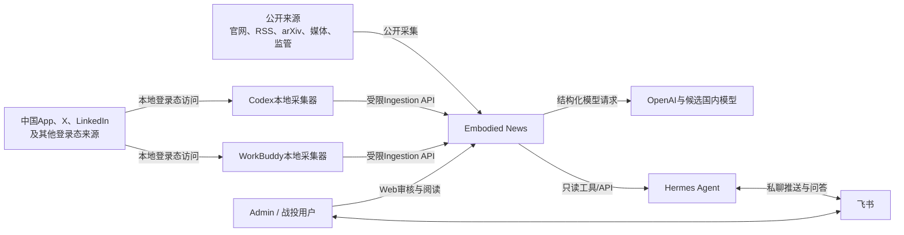
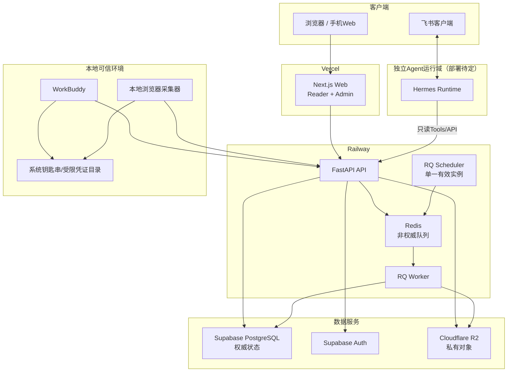
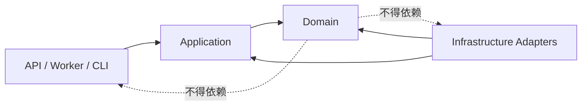
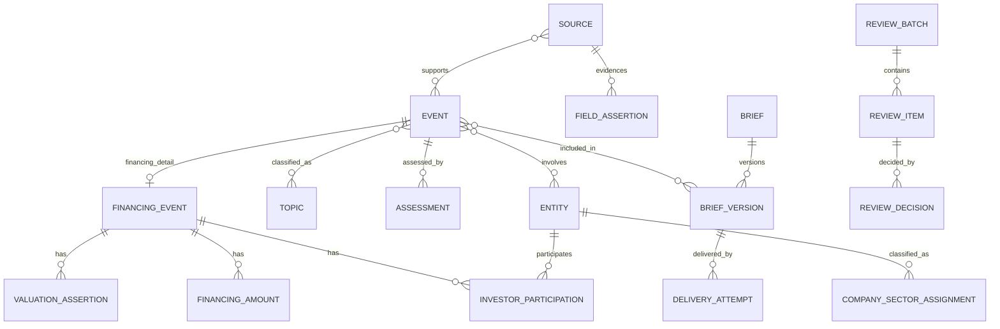
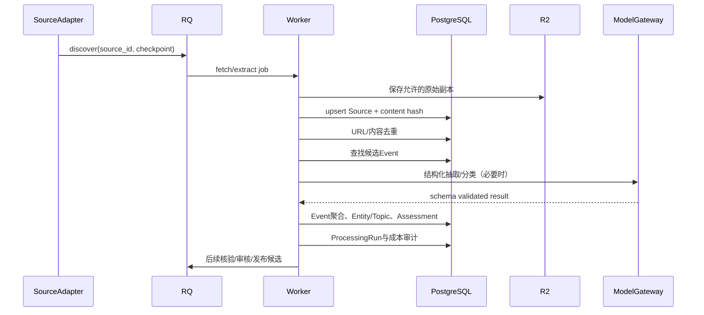
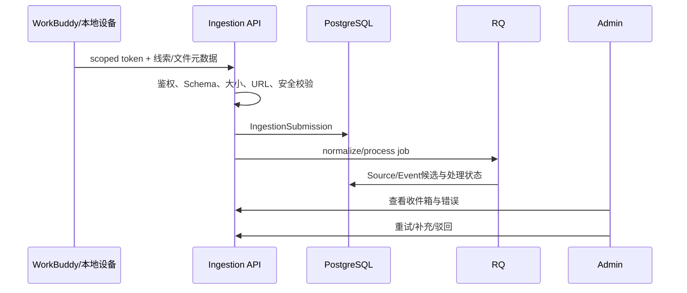
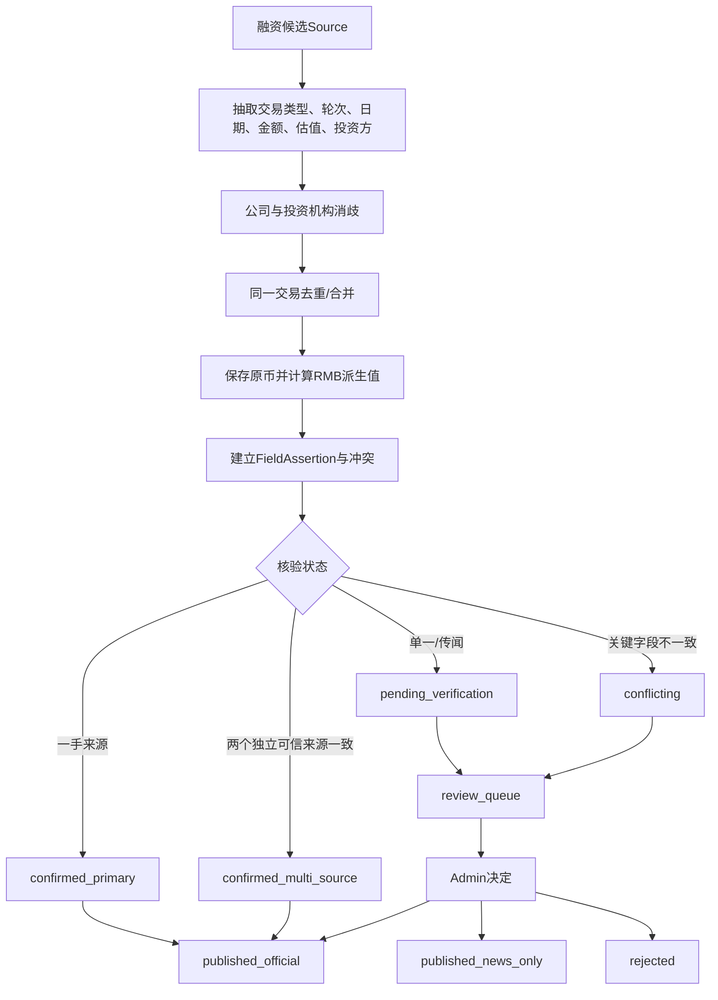
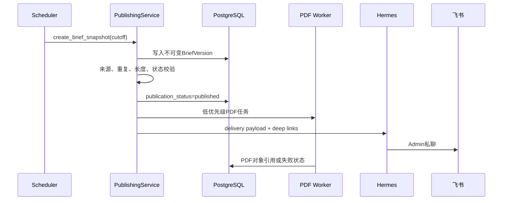
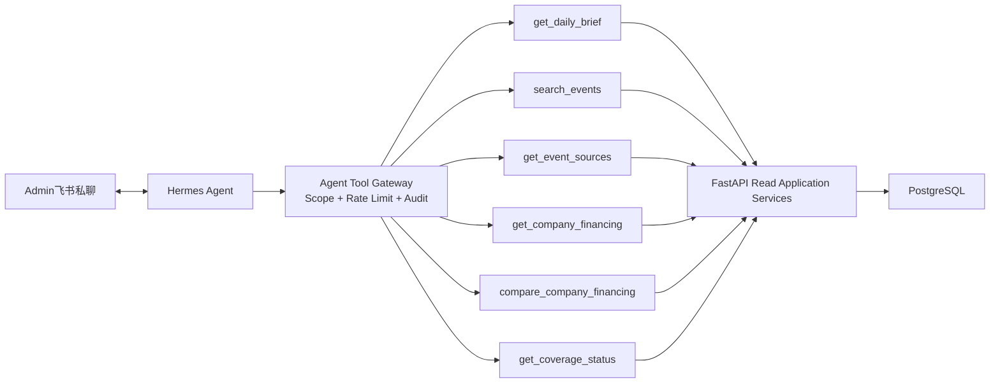

# Embodied News — 系统架构文档

> 状态：v1.0，MVP逻辑架构
> 更新日期：2026-07-27
> 适用里程碑：2026-08-07 MVP
> 产品范围：[`PRD.md`](./PRD.md)
> 页面与验收：[`design-document.md`](./design-document.md)
> 融资领域：[`FINANCING_DASHBOARD_SPEC.md`](./FINANCING_DASHBOARD_SPEC.md)
> 技术选型：[`TECH_STACK.md`](./TECH_STACK.md)
> 多Agent规则：[`AGENTS.md`](./AGENTS.md)
> 实际进度：[`progress.md`](./progress.md)

本文件描述系统如何拆分、组件如何通信、数据如何流动，以及关键故障如何降级。它不替代产品需求，也不锁定仍未确认的UI、模型、来源清单和Assessment权重。

## 1. 架构目标

系统首先优化以下目标：

1. 重要信息尽量不漏；
2. 所有发布事实可追溯至原始来源；
3. 每个中国大陆法定工作日09:00稳定发布，即使部分来源或下游失败；
4. 同一真实事件只形成一个Event；
5. 融资统计可重算、可解释、可纠正；
6. 人工审核控制在每个工作日30分钟内；
7. Hermes、WorkBuddy、模型和云平台均可替换；
8. 个人登录态不离开本地；
9. 核心数据可备份、导出和迁移；
10. 月度运行成本不超过500元，不含已有AI工具订阅。

MVP采用 **Monorepo + Modular Monolith + 独立Worker**。当前规模不拆微服务，但模块边界必须清楚，以便未来按负载或安全边界拆分。

## 2. 架构原则

- **PostgreSQL是唯一业务事实源**：Redis、Hermes、WorkBuddy、R2和模型输出都不是权威数据库；
- **Event中心**：Source是证据，Event是真实事件聚合；
- **证据先于结论**：摘要、评分、融资字段和Agent回答均可回到Source或FieldAssertion；
- **确定性外层编排**：规则、RQ和PostgreSQL控制状态、预算、重试、审核与发布；
- **Agent只在边界内推理**：模型不直接控制调度、数据库或权限；
- **发布快照不可变**：Brief发布后通过新版本纠正，不原地无痕覆盖；
- **失败可降级**：采集、PDF或飞书失败不得连锁阻塞Web发布；
- **接口隔离供应商**：模型、存储、搜索、通知和采集器均位于抽象层后；
- **最小权限**：用户、WorkBuddy、本地设备、Hermes和后台任务使用不同Scope；
- **先MVP后扩展**：Notes、通用Timeline和完整搜索不进入8月7日关键路径。

## 3. 系统上下文



信任边界：

- 公开网页、上传文件、Codex与WorkBuddy输入均是不可信内容；
- Codex与WorkBuddy分别可信地代表一台授权本地设备，但其提交内容仍需核验；
- 授权设备可自动提交候选，但Ingestion API成功只代表接收，不代表核验、正式入库或发布；
- Hermes只可信地持有受限只读凭证，不可信任其自由生成内容；
- 模型输出是候选判断，必须通过Schema验证、规则和发布门槛；
- Admin是MVP唯一可执行审核和纠正的用户。

## 4. 容器与运行组件



说明：

- Next.js不直接写数据库；
- FastAPI是所有外部业务写入入口；
- Worker与API复用同一应用/领域服务，内部任务不复制业务逻辑；
- Worker可直接通过Repository访问PostgreSQL，但必须经过同一应用服务与审计规则；
- Redis只保存可重建任务，不保存唯一事实；
- R2保存原始副本、允许保存的附件、PDF和导出文件，元数据留在PostgreSQL；
- Hermes具体部署位置尚待验证，逻辑上始终是独立对话层。

## 5. Monorepo与模块边界

```text
apps/web/
  app/                       Next.js routes
  features/                  Brief、Financing、Review、Ingestion、Sources
  components/                页面级组件

backend/src/
  domain/
    intelligence/            Source、Event、Entity、Topic、Assessment
    financing/               融资聚合、断言、状态和统计规则
    publishing/              Brief、版本、Delivery、工作日历
    review/                  ReviewBatch、ReviewItem、ReviewDecision
    identity/                User、Role、Permission、API credential
  application/
    ingestion/               采集用例
    processing/              去重、消歧、评分、摘要用例
    financing/               融资抽取、核验、统计用例
    publishing/              编排、发布、纠正、递送用例
    agent_tools/             Hermes只读工具用例
  infrastructure/
    db/                      SQLAlchemy Repository
    queue/                   RQ Adapter
    storage/                 R2 StorageService
    models/                  ModelGateway
    sources/                 SourceAdapter实现
    delivery/                Feishu/Hermes与PDF Adapter
    observability/           日志、Sentry、审计
  api/
    routes/                  HTTP routes
    schemas/                 Pydantic request/response
    auth/                    身份与授权依赖

workers/
  tasks/                     薄任务入口
  scheduler/                 计划注册

packages/api-client/         OpenAPI生成Client
packages/ui/                 公共UI与Token
```

依赖方向：



规则：

- Domain不依赖FastAPI、RQ、Supabase、R2、Hermes或具体模型SDK；
- Application编排用例与事务，不包含供应商细节；
- Infrastructure实现Repository和外部Adapter；
- API与Worker只负责校验、鉴权、调用应用服务和转换结果；
- 跨模块写操作必须经过明确应用服务；
- 统计查询可以有专用Read Model，但不能成为第二事实源。

## 6. 核心领域关系



关键边界：

- `Source`保存来源元数据、原始对象引用和内容哈希；
- `Event`保存真实事件聚合，不复制全部原文；
- Source与Event是多对多关系；
- `FinancingEvent`扩展Event，不替代Event；
- 融资金额、估值和关键字段以带证据的Assertion表达；
- Entity统一公司与投资机构身份；
- Brief由不可变`BriefVersion`组成；
- 人工审核保存批次、条目、决定和前后版本。

精确字段、索引、约束和枚举必须在数据模型设计与ADR中确认，本图不是DDL。

## 7. 通用采集与事件处理流



去重分层：

1. URL规范化；
2. 内容哈希；
3. 标题、实体、时间和文本相似度；
4. Event Resolver语义判断；
5. 低置信合并进入人工审核。

不得仅依赖向量相似度直接合并Event。拆分与合并均需保留历史映射。

## 8. WorkBuddy与人工输入流



支持入口：

- URL；
- 文本；
- PDF；
- CSV/JSON；
- WorkBuddy受限API。

所有入口进入同一条处理链。CSV/JSON允许部分成功：成功行入队，失败行返回稳定错误码和行号。

个人Cookie、Session、Token和Browser Profile永不进入云端。任一Codex/WorkBuddy本地采集器离线或数据陈旧时，必须按受影响平台显示覆盖降级。

## 9. 融资处理流



独立来源按原始证据链判断，而不是按URL或媒体数量判断。转载同一报道、引用同一匿名爆料或复述同一社交帖子只形成一个证据链；公司与投资机构分别发布的公告可形成两个独立证据链。官方一手来源也必须通过实体、关键字段和冲突校验。

Source Registry保存版本化可信度等级与分数：A为90–100、B为75–89、C为55–74、D为0–54。A级通过校验可单独确认，两个不同证据链的B级可多来源确认，两个C级不能自动确认，D级只能待核实。等级调整创建新版本，不回写旧Assessment。

必须分离：

- `verification_status`；
- Review状态；
- `publication_status`；
- `include_in_statistics`。

重要性评分不能代替事实核验。待证实、冲突、驳回、撤回或被替代数据默认不进入正式统计。

Daily Brief自动进入门槛为：证据状态合格、相关性评分≥70、影响力评分≥60且无冲突或风险标记。各分项使用0–100；相关性、事件影响、来源可信度、新颖性、Watchlist相关性、多来源验证的初始权重为25%、25%、20%、10%、10%、10%。综合分只用于排序和栏目，权重与阈值作为版本化配置保存；已确认但低影响内容进入“更多值得关注”，其他相关候选继续保留。

融资FX派生值优先使用正式公告日汇率；当天无值时使用此前最近可用工作日；只知月份时使用月末最后可用工作日并标记估算。换算记录保存供应商、汇率日期、方法和版本；后续补充披露不覆盖旧值，只有交易日期被正式纠正时创建新版本并重算。

## 10. 审核与早间调度

```mermaid
timeline
    title Asia/Shanghai 中国大陆法定工作日调度
    08:00 : 生成融资ReviewBatch
    08:00-08:30 : Admin处理最多15个必审项
    08:30 : 冻结Brief候选快照
    08:30-09:00 : Editor编排与发布前校验
    09:00 : 发布Web Brief
          : Hermes向飞书私聊递送
    09:00之后 : PDF完成或重试
```

调度器读取版本化的中国大陆官方工作日历：调休补班日按工作日运行，非工作日跳过全部Brief、PDF和飞书递送任务。采集、处理、核验与满足自动证据门槛的融资看板更新全年持续运行；待审核事件保留至下一工作日批次。非工作日及08:30后事件进入下一个工作日Brief，早报页显示上一份Brief和下一次发布时间。

长假后Brief Composer仍选择15–25条核心内容和3–5条重点；其他相关Event进入可展开的“假期更多动态”。BriefVersion保存累计候选数、核心收录数和覆盖区间；PDF只渲染核心内容并链接到Web完整列表。

审核中心：

- 必须处理区最多15条；
- 其余进入可选查看；
- 展示证据、冲突、建议、截止时间和未处理后果；
- 支持通过、修改后通过、待证实、驳回、合并、重新处理和批量通过；
- 未审核时只允许满足自动证据门槛的内容发布。

08:00融资审核、08:30 Brief冻结和09:00发布必须具有不同任务类型、幂等键和运行审计。MVP不创建Alert汇总任务。

## 11. Brief生成与递送



发布门槛：

- 正文约15–25个主要Event；
- 3–5个“今日最重要”；
- 待核实信息独立；
- 每个事实至少有一个有效来源；
- 失败来源形成覆盖声明；
- 同一Event不得重复进入主要栏目。

降级：

- 部分采集失败：Web按时发布并显示覆盖缺口；
- PDF失败：Web与飞书照常，PDF重试并更新入口状态；
- Hermes/飞书失败：Web与PDF照常，记录`DeliveryAttempt`并重试；
- 模型失败：使用已有结构化数据/规则降级，不能编造完整摘要；
- 发布失败：高优先级告警与可人工重放。

PDF入口使用稳定的Web URL，而不是假定09:00已有PDF文件：

- 尚未生成时显示“生成中”；
- 完成后同一入口提供下载；
- 失败时显示失败状态与重试；
- 如有必要，Hermes可在完成后补发一次更新；
- 09:00验收不要求消息直接附带已生成的PDF文件。

## 12. Hermes与飞书架构



约束：

- Hermes不得直连PostgreSQL；
- Hermes使用独立、可撤销、只读Scope；
- 只允许白名单工具，不能访问任意内部Endpoint；
- 工具执行输入校验、字段/行权限、限流和审计；
- 回答必须包含来源、核验状态、覆盖范围和网站深链；
- 工具返回结构化事实，Hermes只负责对话组织；
- Hermes不能审核、编辑Watchlist、写数据库或触发外部行动；
- Hermes不是唯一Scheduler或事实源；
- Prompt Injection不能改变工具权限。

Hermes是首选对话层。其生产部署或第三方智能体授权不稳定时，系统可切换到直接飞书应用/机器人Adapter；两者复用同一Agent Tool Gateway、只读Scope、限流和审计。具体授权步骤、凭证轮换和切换手册仍需验证。

## 13. API边界

### 13.1 用户API

面向Web Admin与Reader：

- Brief读取与历史版本；
- Event/Source详情；
- 融资列表、详情、统计和公司对比；
- 审核与纠正；
- Watchlist；
- 收件箱；
- Source Health、运行状态、成本和导出。

### 13.2 Ingestion API

面向WorkBuddy与本地设备：

- 创建提交；
- 上传或登记原始对象；
- 查询提交状态；
- 重试允许重试的失败；
- 获取Schema/版本能力。

与用户API使用不同Credential、Scope、限流和审计。

### 13.3 Agent Tool API

面向Hermes：

- 严格只读；
- 白名单Tool；
- 最小响应字段；
- 每次调用记录Agent、会话、工具、参数摘要、结果状态和耗时；
- 不返回私人登录态、内部Prompt、隐藏推理或不必要的原文全文。

### 13.4 接口通用规则

- REST前缀`/api/v1`；
- Pydantic请求/响应与ORM分离；
- Cursor Pagination；
- 稳定错误格式：`code`、安全`message`、`request_id`、`retryable`；
- 审核/纠正使用版本号或ETag；
- OpenAPI生成TypeScript Client；
- 破坏性变更需要新版本或明确迁移。

本节描述能力边界，不是最终Endpoint清单。精确契约需另写OpenAPI/Agent Tool Spec。

## 14. 队列、任务与幂等

队列：

- `high`：09:00发布、关键审核后处理；
- `default`：常规采集、Event处理、融资核验、递送；
- `low`：历史回溯、PDF、重新嵌入、批量导出。

每个任务必须包含：

- 业务对象ID与输入版本；
- 幂等键；
- 超时；
- 有限重试；
- 指数退避；
- 终态；
- ProcessingRun/DeliveryAttempt审计。

推荐幂等键示例：

```text
source-fetch:{source_id}:{checkpoint}
source-process:{source_id}:{content_hash}:{pipeline_version}
event-assess:{event_id}:{evidence_version}:{assessment_version}
financing-resolve:{candidate_id}:{resolver_version}
brief-snapshot:{business_date}:{cutoff_version}
brief-delivery:{brief_version_id}:{channel}:{recipient}
pdf-render:{brief_version_id}:{template_version}
```

任务重放不得重复创建Event、融资累计、Brief条目、模型费用或消息递送。

## 15. 搜索与Read Model

MVP只实现早报、事件、融资和Hermes问答需要的查询：

- PostgreSQL FTS；
- 应用侧中文分词；
- `pg_trgm`模糊匹配；
- 明确的公司别名与实体映射；
- 融资统计Read Model。

`SearchService`隔离具体实现。`pgvector`属于后续能力，只用于Event摘要、Entity和Note等明确对象，不把向量数据库作为MVP事实源。

融资统计：

- 从权威事件与Assertion重算或刷新快照；
- 每张卡片记录时间范围、交易类型、核验/发布状态、未披露数量和更新时间；
- 首页融资总额只含股权融资与战略投资；
- 缓存/物化视图可丢弃并重建。

31家公司回溯采用分层覆盖：19家全栈至少检查官方渠道与两个外部融资/新闻来源，5家大脑和7家本体至少检查官方渠道与一个外部来源。按公司保存检查来源、最后检查时间、覆盖状态和缺口；无融资结果必须有覆盖证据，不能由空白推断。

## 16. 存储架构

### PostgreSQL

保存：

- 领域实体与关系；
- 版本、状态与审计；
- 任务权威状态；
- Source元数据与R2引用；
- 模型、Prompt、Schema和处理版本；
- 用户、角色、Scope和反馈。

### R2

保存：

- 允许保存的网页/公告/论文原始副本；
- PDF和用户上传文件；
- 字幕及允许保存的媒体衍生物；
- 导出文件与备份对象。

要求：

- 私有Bucket；
- SHA-256完整性与去重；
- 数据库保存对象归属、类型、哈希和生命周期；
- 通过`StorageService`访问，不依赖R2专有业务API。

### Redis

仅保存：

- RQ队列；
- 可重建的短期调度信息；
- 非权威临时锁或限流状态。

Redis清空不能导致唯一业务事实丢失。

## 17. 安全架构

### 17.1 身份与权限

- Supabase Auth负责身份；
- FastAPI内部角色/权限表负责授权；
- MVP只有Invite-only Admin；
- WorkBuddy设备Token、Hermes Token和用户Session完全分离；
- 每个Token可撤销、轮换并限制Scope。

### 17.2 Secret

- 云端Secret只存Vercel、Railway、GitHub Actions安全配置；
- 本地登录态存系统钥匙串或受限目录；
- `.env.example`只含变量名；
- `.env.local`不得提交；
- Admin只显示是否配置，不返回原文。

### 17.3 不可信输入与Prompt Injection

- 网页、PDF、帖子、字幕和上传文本全部视为数据；
- 内容中的指令不得成为系统指令；
- 模型只接收完成任务所需字段；
- Agent工具权限由服务端固定，不由Prompt决定；
- 输出必须经过Schema验证；
- 高风险决定经过规则或人工门槛。

### 17.4 日志与隐私

禁止记录：

- Cookie、Session、Authorization、API Key；
- 完整Browser Profile；
- 无关私人信息；
- 模型隐藏推理；
- 不必要的完整受版权保护正文。

Sentry和日志必须脱敏。公开页面只展示原创摘要、必要短摘录、结构化信息和来源链接。

## 18. 可观测与审计

所有日志使用JSON，并尽量携带：

- `request_id`；
- `run_id`；
- `task_id`；
- `source_id`；
- `event_id`；
- `financing_event_id`；
- `brief_id`；
- `delivery_attempt_id`。

PostgreSQL保存：

- `IngestionRun`；
- `ProcessingRun`；
- 模型/Agent调用、版本、耗时和成本；
- Review决定和字段前后值；
- Brief发布与纠正；
- PDF生成；
- Hermes/飞书调用；
- DeliveryAttempt；
- 备份和恢复检查。

Admin需要看到：

- 来源最后成功时间与连续失败；
- 各阶段数量和异常为零；
- 正在重试和终态失败；
- 09:00发布状态；
- 飞书/PDF状态；
- 模型成本和预算异常；
- 历史回溯覆盖率。

## 19. 备份与恢复

- 每份工作日Brief发布后执行PostgreSQL逻辑备份，同时保持数据库每日备份策略；
- R2根据SHA-256清单进行对象增量备份；
- 备份加密并存入独立故障域；
- 保留7天每日、8周每周、12个月每月备份；
- Notes和已发布Brief软删除至少30天；
- 详细任务/普通模型调用记录默认90天；
- 临时处理中间文件成功后7天内清理；
- 每月自动恢复校验，每季度完整恢复演练；
- 本地副本不能是唯一备份。

## 20. 故障降级矩阵

| 故障 | 用户表现 | 系统行为 | 是否阻塞09:00 Web |
| --- | --- | --- | --- |
| 单个公开来源失败 | 显示覆盖缺口 | 有限重试，保留最后成功时间 | 否 |
| Codex或WorkBuddy本地采集器离线 | 对应登录态平台覆盖降级 | 按设备保留待同步状态 | 否 |
| Redis短暂不可用 | 任务延迟 | 从PostgreSQL审计恢复/重放 | 视恢复时间，必须告警 |
| 模型供应商失败 | 摘要/核验降级 | 规则、缓存结果或后备模型 | 否，禁止编造 |
| Event聚类低置信 | 进入审核 | 不自动错误合并 | 否 |
| 融资字段冲突 | 待核验 | 不进入正式统计 | 否 |
| PDF失败 | PDF入口处理中/失败 | 低优先级重试 | 否 |
| Hermes/飞书失败 | 未收到私聊 | DeliveryAttempt重试并告警 | 否 |
| PostgreSQL不可用 | 服务不可写/不可发布 | 停止写入，告警与恢复 | 是 |
| R2不可用 | 原始对象/PDF不可用 | 元数据保留，任务重试 | Web可降级 |
| 备份失败 | Admin高优先级告警 | 重试并要求人工检查 | 否 |
| 预算异常 | Admin告警 | 停止非关键高成本任务 | 否 |

## 21. 部署拓扑与环境

### MVP生产

| 组件 | 平台 | 可否有状态 |
| --- | --- | --- |
| Next.js | Vercel Hobby | 无状态 |
| FastAPI | Railway Hobby | 无状态 |
| RQ Worker/Scheduler | Railway Hobby | 业务状态在PostgreSQL |
| Redis | Railway | 非权威 |
| PostgreSQL/Auth | Supabase Free | 权威 |
| 对象存储 | Cloudflare R2 | 文件对象 |
| Hermes | 待验证的独立运行单元 | 仅会话/对话层 |

FastAPI与Worker使用同一Python镜像、不同启动命令。生产容器必须：

- non-root；
- 固定基础镜像；
- 健康检查；
- 只挂载必要Secret；
- 构建后Smoke Test。

### 本地开发

- Next.js、FastAPI、RQ默认在本机运行；
- Docker Compose运行本地PostgreSQL和Redis；
- Codex本地采集器与WorkBuddy作为独立进程；
- 本地不得连接生产数据库做普通开发；
- CI必须真实构建生产镜像。

## 22. 扩展路径

仅在实际指标触发时演进：

- PostgreSQL搜索不足 → 评估专用搜索引擎；
- 语义检索需求明确 → 增加`pgvector`；
- Worker负载隔离需要 → 按Ingestion、Intelligence、Publishing拆进程；
- 单体部署成为瓶颈 → 保留Domain/Application，拆独立服务；
- 用户增加 → 增加Editor/Reader/部门权限；
- Hermes写操作需求 → 单独权限设计、审批和ADR；
- 公开/商业化 → 重评Vercel Hobby、数据版权、访问控制和成本；
- Notes/通用Timeline → 在现有Event/Entity/Source基础上增加，不复制知识库。

不得因为“未来可能需要”提前引入微服务、Kafka、Elasticsearch、独立向量数据库或复杂工作流框架。

## 23. MVP容量与资源保护

MVP没有高并发目标，主要容量风险来自采集、模型处理、历史回溯和PDF争抢资源。

资源原则：

- 08:00–09:00暂停或限速非关键历史回溯；
- `high`队列预留给审核后处理和工作日Brief；
- PDF与批量回溯进入`low`队列；
- 单任务设置正文大小、附件大小、页面数、模型调用数和最长时限；
- 对Source、设备、Hermes工具和用户API分别限流；
- 缓存不得掩盖数据版本或覆盖状态；
- Worker数量与内存根据一周实测决定，不在架构文档写死；
- 达到预算阈值时先停止非关键转录、深度Agent和历史回溯。

需要持续测量：

- 每日候选Source/Event数量；
- 各队列等待时间和P95任务耗时；
- 08:30候选快照至09:00发布耗时；
- 模型调用次数、Token和成本；
- PDF生成时间；
- 数据库、Redis和Worker内存；
- WorkBuddy提交成功率；
- Hermes工具延迟与失败率。

## 24. MVP实施切片

建议依赖顺序：

1. Monorepo、环境、PostgreSQL、Alembic、Auth和运行审计；
2. Source/Event/Entity、融资Assertion和Review领域模型；
3. Ingestion API、统一收件箱与首个公开SourceAdapter；
4. 去重、Event Resolver、融资抽取/核验和固定Fixture；
5. 审核中心与自动发布门槛；
6. Brief Snapshot、09:00 Web发布与覆盖状态；
7. 融资表、统计、全栈专题和2–5家公司即时对比；
8. Playwright PDF及稳定下载状态页；
9. Hermes白名单工具、飞书私聊推送与只读问答；
10. Source Health、成本、备份、恢复和端到端验收。

可以在契约确定后并行，但共享Schema、Migration、OpenAPI和生成Client必须只有一个Owner。

## 25. 待确认架构事项

以下事项尚未锁定：

- Hermes生产部署、直接飞书降级Adapter和飞书授权；
- 首批具体Source Registry名单；
- Codex/WorkBuddy本地采集最终交换Schema、版本和错误语义；
- 具体汇率供应商；
- 国内模型及评测结果；
- Timeline最终可视化形式；
- UI视觉规范；
- 公开和部门级权限。

实现Agent可以提交方案与对比，但不得擅自定案。

## 26. 架构验收清单

架构实现至少满足：

- Web、API、Worker、数据库、存储职责清晰；
- Domain不依赖供应商SDK；
- FastAPI是外部写入入口；
- PostgreSQL是唯一业务事实源；
- Source/Event/FinancingEvent边界正确；
- 融资四类状态分离；
- 任务可幂等重放；
- Brief发布使用不可变快照；
- 部分来源、PDF或飞书失败不阻塞Web；
- Codex与WorkBuddy个人登录态均不上云；
- Hermes只读且通过白名单工具；
- 所有发布事实可回溯；
- 关键运行、审核、递送与模型调用可审计；
- Schema变化通过Alembic；
- 核心数据可备份、恢复和导出；
- MVP成本保持在预算内；
- 可控时钟通过7个完整工作日周期调度测试；真实09:00连续工作日运行证据按实际数量记录并在不足7个工作日时上线后继续补足；
- `design-document.md`第13节验收可被自动或人工验证。
