# 具身智能公司动态雷达系统架构

> 版本：v0.1  
> 状态：MVP 架构基线  
> 更新日期：2026-08-03  
> 来源：`PRD.md`、`SPEC.md`、`TECH-STACK.md`

本文件是系统组件、数据流、部署、安全边界和架构不变量的最高参考。其他 Markdown 如与本文件冲突，应修改其他文档，不应绕过架构不变量。

## 1. 架构目标

系统围绕一条简单且可交接的闭环构建：

1. WorkBuddy 与 OpenAI 发现国内外融资、技术、产品和商业化候选。
2. 统一领域流水线完成校验、抽取、归一化、去重和摘要。
3. 飞书多维表格保存全部正式数据并承担内部审核。
4. Next.js 将审核后的公开数据生成静态网站。
5. GitHub Actions 执行定时任务和发布。
6. GitHub Pages 托管公开新闻网站。

系统不依赖个人电脑持续在线，也不维护独立数据库或独立管理后台。

## 2. 总体架构

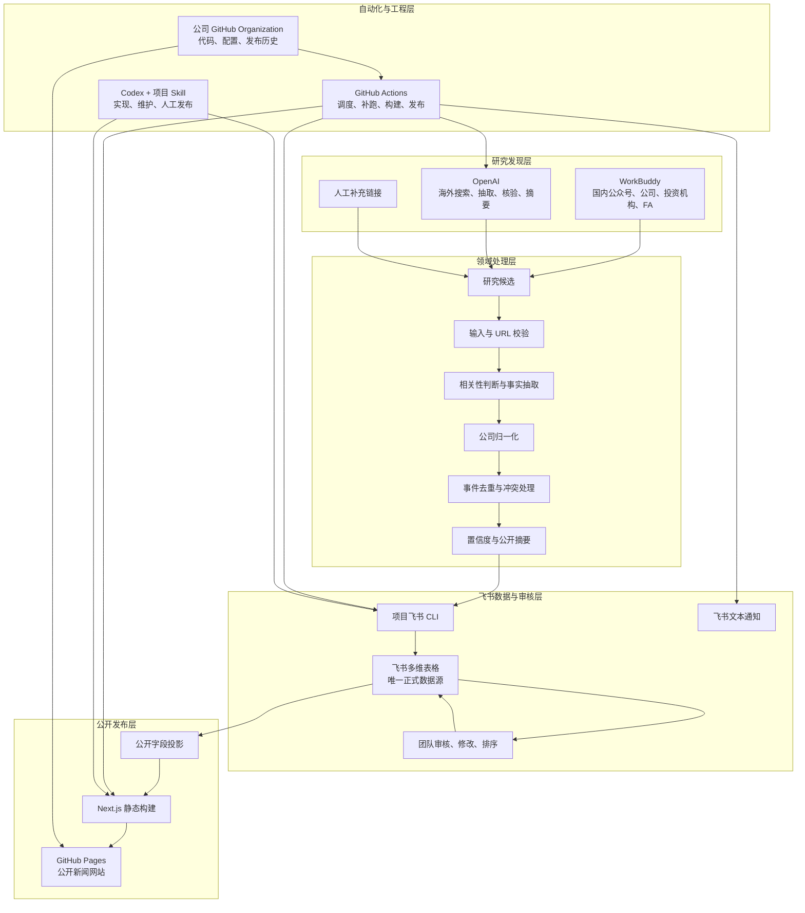

## 3. 组件职责

### 3.1 WorkBuddy

负责国内融资信息发现：

- 微信公众号融资 PR
- 国内公司公告
- 投资机构公告
- FA 融资稿
- 国内创投和机器人产业媒体

MVP 通过固定候选格式和飞书 CLI 导入结果。WorkBuddy只创建研究候选，不能直接修改正式事件、内部判断或发布状态。

若 WorkBuddy只有个人客户端，则不进入无人值守生产 SLA。未来只有在具备公司级云端 API、统一身份和可交接运行环境后，才接入自动调度。

### 3.2 OpenAI

负责海外自动研究和通用 AI 处理：

- 海外公司官网和投资机构公告搜索
- 英文商业、科技与机器人媒体搜索
- 监管披露搜索
- 相关性判断
- 融资字段抽取
- 多来源冲突比较
- 中文摘要与市场观察

OpenAI输出必须通过固定 Schema 校验，只能进入候选层。

### 3.3 领域处理层

领域处理层独立于飞书、OpenAI、WorkBuddy和 Next.js，负责：

- 输入和 URL 安全校验
- 正文清洗
- 行业相关性判断
- 公司、轮次、金额、币种、投资方和日期抽取
- 公司中英文名、别名和官网归一化
- canonical URL 和事件级去重
- 冲突事实保留
- 来源等级和置信度计算
- 公开摘要生成

领域层通过运行时 Schema 接收和输出数据，不直接调用供应商 SDK。

### 3.4 项目飞书 CLI

飞书 CLI 是 Codex、GitHub Actions 和管理员统一使用的数据操作入口，负责：

- 检查飞书连接和字段映射
- 导入 WorkBuddy 候选
- 运行 OpenAI候选发现
- 处理和持久化候选
- 生成日报草稿
- 验证日报发布条件
- 导出网站公开数据
- 记录和重试自动化任务

CLI 使用飞书 OpenAPI 和公司自建应用，不把密钥输出到日志。

### 3.5 飞书多维表格

飞书多维表格是唯一正式数据源，并同时承担：

- 正式结构化数据存储
- 内部 CMS
- 候选审核与修改
- 日报三个固定板块的编辑与排序
- 重点公司、重点赛道、重点公众号和关键词观察清单
- 内部战投备注
- 自动化任务状态
- 基础内部仪表盘

核心数据表：

- 研究候选
- 融资事件
- 公司动态
- 信息来源
- 公司
- 日报
- 观察清单
- 内部战投备注
- 自动化任务

### 3.6 公开字段投影

公开网站不直接读取完整飞书记录。发布前先生成公开 DTO，只允许包含：

- 已发布融资事实
- 已发布技术、产品和商业化动态
- 公司公开资料
- 公开摘要
- 公开来源
- 重要性评分与理由
- 置信度
- 日报和更正说明
- 聚合统计

禁止包含：

- 内部战投备注
- 待审核和被拒绝候选
- 操作人身份
- 飞书记录 ID
- 自动化错误详情
- OpenAI完整请求和响应
- 任何密钥

### 3.7 Next.js 静态网站

Next.js 根据公开投影生成静态 HTML，包含：

- 首页
- 日报详情（三个固定板块，每条内联原始来源）
- 历史归档
- 融资事件详情
- 公司动态详情
- 公司公开档案
- 简单数据看板
- 静态 404

浏览器不直接调用飞书或 OpenAI。所有动态路由和公开数据都在构建时生成。

### 3.8 GitHub Actions

GitHub Actions负责：

- CI
- 周期调度
- OpenAI自动研究
- 候选处理
- 日报生成
- 失败补跑
- 公开数据导出
- Next.js 构建
- GitHub Pages 发布
- 飞书文本通知

定时任务采用“周期检查 + 状态表 + 幂等键”，不只依赖单个固定时间触发。

### 3.9 GitHub Pages

GitHub Pages只负责托管静态网站产物：

- HTML
- CSS
- JavaScript
- 公开 JSON

GitHub Pages不是正式数据源，不负责搜索、审核、AI调用或内部数据存储。发布失败时，上一个成功版本继续可访问。

### 3.10 Codex 与 Claude Code

Codex负责架构、实现、测试、飞书 CLI、自动化、静态网站、集成和故障修复。

项目级 Codex Skill 固化人工发布和维护流程，但 GitHub Actions不依赖交互式 Codex 会话。

Claude Code只对已经完成基础测试的变更做只读审核，重点检查安全、数据隔离、幂等、并发、错误处理和测试缺口。

## 4. 核心数据流

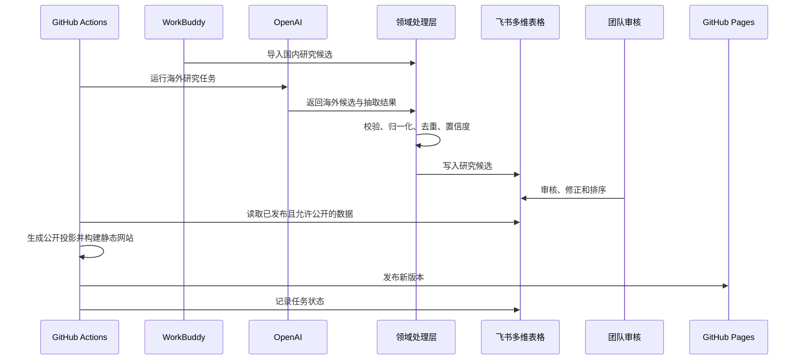

## 5. 自动化模型

GitHub Actions周期性检查飞书“自动化任务”表。

任务类型：

- 海外候选发现
- 候选处理
- 审核稿生成
- 日报发布
- 网站构建
- 飞书通知
- 历史回填

每个任务使用“业务日期 + 任务类型”作为幂等边界，并具备：

- 状态
- 尝试次数
- 任务锁
- 开始和结束时间
- 简化错误
- 人工处理标记

时间线：

- 07:00 后：海外研究和候选处理。
- 08:00 后：生成审核稿并发送飞书审核链接。
- 09:00 后：生成和发布网站，发送网站链接。
- 延迟或失败：下一个调度周期自动补跑。

## 6. 数据一致性模型

飞书多维表格不提供传统关系数据库的完整唯一约束和事务，因此应用层负责：

- 稳定业务 ID
- canonical URL
- 写入前防重
- 乐观并发控制
- 多步骤任务状态
- 幂等补偿
- 字段 ID 映射
- 定期结构化备份

正式数据只在飞书维护。公开 JSON 和 GitHub Pages 网站是可随时重建的下游产物。

## 7. 安全边界

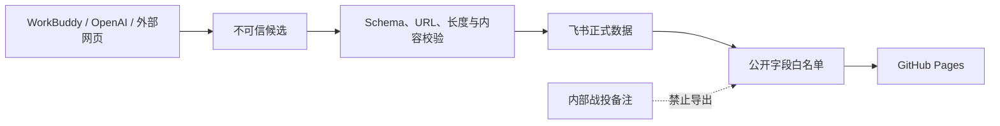

安全原则：

- 外部输入全部视为不可信。
- 外部 Agent不能读取内部战投备注。
- 外部 Agent不能发布内容。
- 浏览器不能获得飞书或 OpenAI密钥。
- Pull Request Workflow不能获得生产 Secrets。
- 生产凭据存放在 GitHub Secrets。
- 飞书应用使用最小权限。
- 所有生产账号和数据归公司管理。
- 至少两名管理员具备恢复能力。

## 8. 部署与所有权

| 资源 | 所有者 | 职责 |
|---|---|---|
| 飞书多维表格 | 公司飞书租户 | 正式数据、审核、通知 |
| 飞书自建应用 | 公司飞书租户 | OpenAPI 身份与权限 |
| OpenAI Project | 公司 | 海外研究和 AI 处理 |
| GitHub Repository | 公司 Organization | 代码、配置和历史 |
| GitHub Actions | 公司 Repository | CI、调度、构建与发布 |
| GitHub Pages | 公司 Repository | 静态网站托管 |
| WorkBuddy | 可移交公司或团队账号 | 国内研究 |

系统不依赖个人电脑、个人 API Project 或个人仓库运行。

## 9. 仓库模块边界

- `lib/domain/`：领域对象、Schema 和业务规则。
- `lib/providers/`：OpenAI、WorkBuddy import 和通知 Adapter。
- `lib/feishu/`：飞书客户端、字段映射和 Repository。
- `lib/pipeline/`：候选处理、日报和调度。
- `lib/publication/`：公开字段投影和网站数据。
- `cli/`：飞书 CLI。
- `app/`：静态网站页面。
- `components/`：共享 UI 和图表。
- `scripts/`：GitHub Actions 使用的确定性入口。
- `.github/workflows/`：CI、调度和 Pages 发布。
- `.agents/skills/`：项目级 Codex Skills。
- `tests/`：Fixture、单元、集成和端到端测试。

依赖规则：

1. 领域层不依赖供应商 SDK 或 Web 框架。
2. Provider 依赖领域契约。
3. CLI 和 Workflow 组合 Provider 与领域服务。
4. UI 只依赖公开 DTO。
5. 内部数据不能流入公开构建模块。

### 9.1 A01 已落地的工程骨架

A01 将“静态网站是正式数据的可重建下游产物”落实到工程层：Next.js 从项目建立之初就使用静态导出，而不是等发布阶段再改造。当前首页只验证编译、测试和静态交付链路；它不是业务数据入口，也不改变飞书作为唯一正式数据源的地位。

当前依赖方向为：

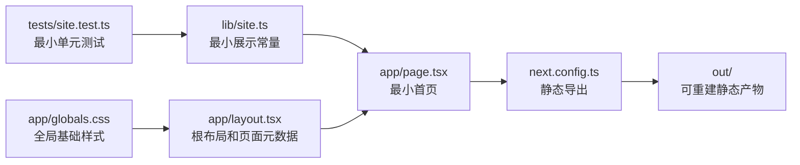

依赖版本采用精确锁定并提交 `pnpm-lock.yaml`，保证本地、CI 和后续 GitHub Actions 使用相同依赖图。pnpm 原生依赖构建许可在仓库级配置中显式列出，避免安装过程隐式执行未知构建脚本。

### 9.2 A01 文件职责

| 文件或目录 | 作用与边界 |
|---|---|
| `package.json` | 项目清单；冻结运行时与开发依赖，并提供开发、类型检查、Lint、单测和构建命令。 |
| `pnpm-lock.yaml` | 依赖图锁文件；保证不同执行环境安装相同版本，不承载业务配置。 |
| `pnpm-workspace.yaml` | pnpm 仓库级安装策略；当前明确允许必需原生依赖构建并关闭非交互式清理确认。 |
| `.gitignore` | 阻止依赖、构建产物、本地缓存、环境文件、密钥文件和日志进入版本库。 |
| `next.config.ts` | Next.js 构建边界；当前强制 `output: "export"`，使网站产出纯静态文件。 |
| `tsconfig.json` | TypeScript 严格编译契约、模块解析规则和 `@/` 源码路径别名。 |
| `next-env.d.ts` | Next.js 的 TypeScript 类型声明入口，由框架约定维护，不放业务类型。 |
| `eslint.config.mjs` | 源码规范与 Next.js、React、TypeScript 静态检查配置。 |
| `vitest.config.ts` | 单元测试发现和 Node 测试环境配置；测试默认不访问外部服务。 |
| `app/layout.tsx` | 所有公开页面的根 HTML 布局、语言和基础元数据入口。 |
| `app/page.tsx` | 当前最小首页；后续只能消费公开 DTO，不得直接访问内部飞书记录。 |
| `app/globals.css` | 当前工程验证所需的全局基础样式；最终设计系统将在 E03 建立。 |
| `lib/site.ts` | A01 的最小展示常量；证明页面逻辑可以与数据定义分离，不是领域模型。 |
| `tests/site.test.ts` | 验证最小首页所需站点元数据，证明 Vitest 测试链路可运行。 |
| `components/.gitkeep` | 保留共享 UI 目录；在 E03 前不预置组件契约。 |
| `cli/.gitkeep` | 保留项目飞书 CLI 目录；CLI 实现从 B06 开始。 |
| `scripts/.gitkeep` | 保留确定性自动化脚本目录；后续供 GitHub Actions 调用。 |
| `out/` | Next.js 静态导出结果，可随时重建且不得作为正式数据源；已被 Git 忽略。 |
| `.next/` | Next.js 临时编译与类型产物，可随时重建；已被 Git 忽略。 |
| `node_modules/`、`.pnpm-store/` | 本地依赖与缓存，不属于项目交付物；已被 Git 忽略。 |

后续扩展必须保持以下工程边界：

1. `app/` 和 `components/` 不直接读取生产飞书凭据或内部记录。
2. 领域类型从 A02 开始进入 `lib/domain/`，不得混入 `lib/site.ts`。
3. 外部服务接入必须等待对应 Provider、Adapter 或 Repository 任务。
4. 静态构建只消费经过公开字段投影的数据。
5. A01 的最小首页可以被后续页面替换，但静态导出与测试门禁必须保留。

### 9.3 A02 领域契约分层

A02 将领域契约分成三层：

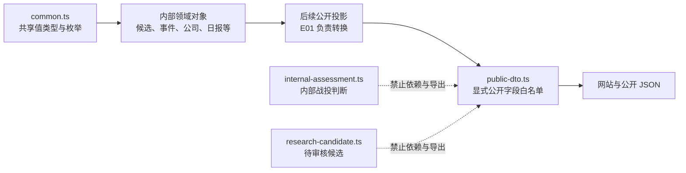

内部领域对象描述系统完整工作状态；公开 DTO 不是内部对象的别名，也不使用自动扩散字段的继承关系。公开类型逐字段声明允许内容，因此未来内部对象新增字段时，不会自动进入网站契约。

TypeScript 类型只处理受信任代码中的编译期契约。WorkBuddy、OpenAI、飞书和文件输入仍是不可信数据，必须在 A03 经过 Zod Schema 后才能进入领域层。

### 9.4 A02 文件职责

| 文件 | 作用与边界 |
|---|---|
| `lib/domain/common.ts` | 共享值类型、稳定 ID 别名、来源类型、地域、审核和发布状态、币种、置信度、融资事实与冲突结构。 |
| `lib/domain/research-candidate.ts` | 未经正式审核的研究候选及相关性判断；包含原始片段、重复和冲突信息，不属于公开契约。 |
| `lib/domain/funding-event.ts` | 经领域处理后的融资事实、公开文案、来源证据和发布控制状态。 |
| `lib/domain/company.ts` | 公司标准名称、别名、官网、地区、技术标签和公开简介。 |
| `lib/domain/daily-digest.ts` | 单日公司动态日报、三个固定板块、板块内排序、审核状态、发布状态、自动发布与更正信息。 |
| `lib/domain/watch-item.ts` | 公司、机构、FA、公众号、关键词和赛道等研究观察目标。 |
| `lib/domain/internal-assessment.ts` | 内部关注等级、战略判断和跟进信息；通过互斥联合类型只关联公司或事件之一。 |
| `lib/domain/automation-run.ts` | 自动化任务类型、状态、业务日期、尝试次数、时间和简化错误。 |
| `lib/domain/public-dto.ts` | 网站允许消费的公开融资、公司、日报和来源白名单类型；禁止候选和内部判断字段。 |
| `lib/domain/index.ts` | 领域层统一导出入口，供 Provider、CLI、流水线和后续公开投影依赖。 |
| `tests/fixtures/domain.ts` | 不含真实内部信息的合法领域样例，集中证明各类型可组合。 |
| `tests/domain/types.test.ts` | 运行时检查合法 Fixture 关键不变量，以及公开对象不含内部字段。 |
| `tests/type-contracts/public-dto.ts` | 编译期契约测试，新增禁止字段时能够让类型检查失败。 |

A02 进一步冻结以下边界：

1. `ResearchCandidate` 永远不是公开 DTO。
2. `InternalAssessment` 不得被公开模块导入。
3. 公开 DTO 必须显式列出字段，不得直接扩展完整内部记录。
4. `amountDisclosed=false` 时允许金额和币种为 `null`，不得用估算值替代。
5. 完整运行时信任边界由 A03 Schema 建立，不以类型断言替代。

### 9.5 A03 运行时信任边界

A03 在所有外部数据进入领域对象之前建立统一 Zod 校验层：

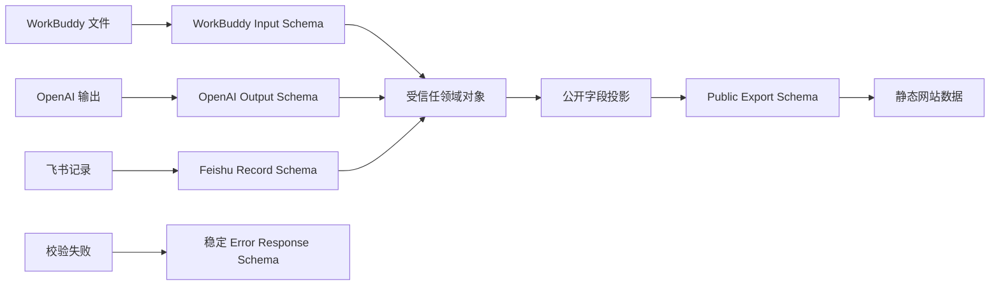

所有边界对象采用严格模式。未知字段会使校验失败，而不是在不知情的情况下被接受或传播。这样可以阻止外部 Agent 添加发布状态、内部判断或其他越权字段。

URL 校验是分层防御：

1. A03 在输入阶段限制协议、长度、凭据和显然危险的主机地址。
2. C04 在实际内容获取阶段重新检查 DNS 结果、重定向后的最终地址、超时和响应大小。
3. 网站只接收通过公开导出 Schema 的 URL。

公开 Schema 与内部 Schema 分开逐字段声明。即使内部融资事件或飞书记录增加字段，公开导出也不会自动继承它们。

### 9.6 A03 文件职责

| 文件 | 作用与边界 |
|---|---|
| `lib/domain/schemas/primitives.ts` | 稳定 ID、ISO 日期时间、十进制金额、有界文本和安全公开 URL 等可复用基础规则。 |
| `lib/domain/schemas/domain.ts` | A02 七类领域对象的运行时 Schema，以及金额披露、公司名称和内部判断关联等跨字段不变量。 |
| `lib/domain/schemas/boundaries.ts` | WorkBuddy、OpenAI、飞书、公开网站和错误响应五类系统边界 Schema。 |
| `lib/domain/schemas/index.ts` | Schema 统一导出入口。 |
| `lib/domain/index.ts` | 同时导出领域类型与运行时 Schema，供后续 Provider、Repository 和 CLI 使用。 |
| `tests/schemas/boundaries.test.ts` | 验证五类边界的合法、缺字段、错类型、超长、未知字段和危险 URL 行为。 |
| `tests/schemas/domain.test.ts` | 验证七类领域 Fixture、金额披露一致性和内部判断互斥关联。 |
| `package.json`、`pnpm-lock.yaml` | 精确锁定 Zod 4.4.3 及其依赖图。 |

A03 冻结以下规则：

1. 外部输入不能通过 TypeScript 类型断言绕过 Zod。
2. 所有边界对象默认拒绝未知字段。
3. 金额只能使用十进制字符串；未披露金额不得填入推测值。
4. 公开导出必须通过独立白名单 Schema。
5. Schema 失败返回稳定、限长且不包含内部堆栈的错误对象。
6. 单个 URL 通过 A03 不等于允许抓取；网络层必须在 C04 再次校验。

### 9.7 A04 配置与密钥边界

A04 将环境模式、Provider 模式和浏览器公开配置分开：

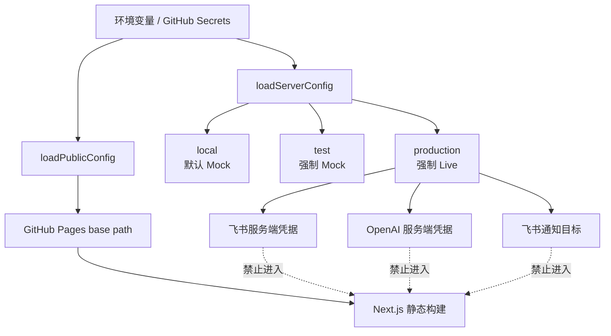

环境和 Provider 模式是两个不同概念：

- 环境描述代码运行位置和安全要求。
- Provider 模式描述是否允许调用真实外部服务。
- 本地开发默认 `local + mock`，无需真实账号。
- 自动测试只能使用 `test + mock`。
- 生产任务只能使用 `production + live`，且缺少任何必需配置都会快速失败。

只有 `NEXT_PUBLIC_SITE_BASE_PATH` 属于公开构建配置。飞书和 OpenAI 变量不使用 `NEXT_PUBLIC_` 前缀，也不通过公开配置加载器返回。

### 9.8 A04 文件职责

| 文件 | 作用与边界 |
|---|---|
| `lib/config/error.ts` | 将 Zod 配置错误转换为不包含配置值的稳定 `ConfigurationError`。 |
| `lib/config/public.ts` | 只读取和校验允许进入静态构建的站点 base path。 |
| `lib/config/server.ts` | 读取运行环境、Provider 模式、时区及飞书、OpenAI、通知服务端配置。 |
| `lib/config/index.ts` | 配置模块统一导出入口。 |
| `.env.example` | 配置变量清单和安全空白模板；不得保存真实值。 |
| `next.config.ts` | 使用已校验的公开 base path 配置 Next.js 静态导出。 |
| `tests/config/environment.test.ts` | 验证环境模式、必填配置、错误脱敏、时区、base path 和公开配置隔离。 |

A04 冻结以下规则：

1. 业务代码不得直接散落读取 `process.env`，必须通过配置加载器。
2. 测试环境不得使用 Live Provider。
3. 生产环境不得静默退回 Mock Provider。
4. 服务端配置不得由公开加载器返回。
5. 配置错误不得输出密钥原值。
6. `.env.example` 只能提供变量名称和非敏感示例。
7. 生产密钥只能存放在 GitHub Secrets 或明确受保护的本地环境中。

### 9.9 A05 测试替身边界

A05 为后续外部集成建立完全离线的测试替身层：

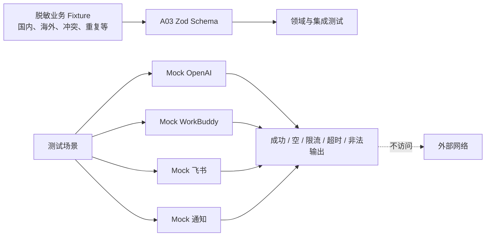

Fixture 和 Mock 的职责不同：

- Fixture 是固定、脱敏、可重复的数据样本。
- Mock 是外部平台行为的测试替身。
- Fixture 必须通过领域或边界 Schema。
- `invalid_output` 是唯一有意不通过 Schema 的 Mock 输出，用来测试失败处理。

Mock 不属于生产 Provider，不应被生产代码或 GitHub Actions Live 模式导入。后续真实 Provider 可以在测试中使用这些场景验证相同行为，但不得让 Mock 接口反向限制真实供应商 Adapter 的合理设计。

### 9.10 A05 文件职责

| 文件 | 作用与边界 |
|---|---|
| `tests/fixtures/scenarios.ts` | 国内、海外、未披露、多来源、冲突、重复和低置信度业务样本。 |
| `tests/fixtures/providers.ts` | WorkBuddy 输入、OpenAI 输出和飞书记录等 Provider 边界样本。 |
| `tests/mocks/scenario.ts` | 五种统一 Mock 场景及稳定限流、超时测试错误。 |
| `tests/mocks/openai.ts` | 模拟 OpenAI 结构化研究结果，不进行模型或网络调用。 |
| `tests/mocks/workbuddy.ts` | 模拟 WorkBuddy 候选导出，不访问客户端或公众号。 |
| `tests/mocks/feishu.ts` | 模拟飞书记录读取、写入结果和写入历史，不访问真实多维表格。 |
| `tests/mocks/notification.ts` | 模拟文本通知结果和发送历史，不发送真实消息。 |
| `tests/mocks/index.ts` | 测试 Mock 统一导出入口。 |
| `tests/mocks/providers.test.ts` | 验证 Fixture Schema、五种 Mock 场景和完全离线行为。 |

A05 冻结以下规则：

1. 单元和普通集成测试不得访问真实外部服务。
2. 测试 Fixture 不得包含真实密钥、完整受版权保护正文或内部判断。
3. Mock 超时不得使用真实长等待。
4. Mock 限流和超时必须使用稳定错误码。
5. 非法输出必须由测试显式选择，不能成为默认行为。
6. 生产代码不得依赖 `tests/mocks/`。
7. 真实 Provider 测试必须经过用户明确授权并使用受控公司凭据。

### 9.11 B01 飞书九表模型与文件职责

B01 冻结的是飞书多维表格的本地工程设计，不代表真实飞书资源已经创建。九张表职责如下：

| 表 | 架构职责 |
|---|---|
| 研究候选 | 接收 WorkBuddy、OpenAI 和人工提交的融资、技术、产品或商业化线索；只供内部审核。 |
| 融资事件 | 保存审核后的正式融资事实、重要性和发布控制；同一公司每轮融资各一条。 |
| 公司动态 | 保存审核后的技术、产品和商业化进展、重要性和发布控制。 |
| 信息来源 | 保存逐条原始链接、发布主体、来源等级和链接验证时间；被融资事件或公司动态引用。 |
| 公司 | 保存唯一公司档案，并聚合该公司的多轮融资和长期公司动态。 |
| 日报 | 每个业务日期最多一条，固定包含今日融资、技术与产品、商业化进展三个板块。 |
| 观察清单 | 驱动重点公司、重点赛道、重点公众号、关键词、机构和 FA 的主动搜索。 |
| 内部战投备注 | 保存内部关注、判断、负责人和跟进状态；禁止进入公开投影。 |
| 自动化任务 | 保存定时任务的幂等、锁、重试、错误摘要和人工处理状态。 |

日报不存在独立来源板块。每个可发布融资事件或公司动态必须关联至少一个可访问的原始来源，公开投影将链接内联到对应条目。板块默认按 1–5 重要性评分降序，人工确认的最终顺序优先。

| 文件 | 作用与边界 |
|---|---|
| `lib/feishu/schema-definition.ts` | 九张表的机器可读字段、类型、选项、关联、公开性、视图和排序基线；不包含真实飞书 ID。 |
| `lib/feishu/field-id-manifest.ts` | 根据表和字段业务键生成稳定配置键，供后续真实 table ID、field ID 安全映射。 |
| `lib/feishu/index.ts` | 飞书表设计模块的统一导出入口。 |
| `docs/feishu-schema.md` | 公司管理员创建九张真实表、配置视图、映射字段 ID 和人工验收的操作清单。 |
| `tests/fixtures/feishu-design.ts` | 公司、融资、公司动态、来源和日报的五条脱敏关联样例。 |
| `tests/feishu/schema-definition.test.ts` | 验证九表完整性、公开隔离、关联、字段映射、三板块日报、来源要求和重要性排序。 |

B01 冻结以下规则：

1. 重点公司和重点赛道是观察清单中的独立类型。
2. 来源可信等级不能替代搜索优先级；高优先级媒体仍可能只是二手来源。
3. 公司与融资事件、公司动态均为一对多关系。
4. 日报固定三个板块，每条内容携带自己的来源。
5. 无可访问原始来源的内容不得发布。
6. 九表的真实创建和权限验证属于 B02；真实 ID 映射验证属于 B04。
7. 新增公司动态领域对象、公开 DTO 和运行时 Schema 属于 A06，不在 B01 中越界实现。

### 9.12 B02 真实飞书资源与权限边界

B02 已验证应用身份可以对指定正式 Base 完成读取和受控写入。真实凭据仅保存在被 Git 忽略且限制本机文件权限的 `.env.local`；后续生产凭据仍必须迁移到公司 GitHub Secrets。

飞书客户端必须将正式 Base Token 视为部署配置，而不是用户输入。CLI、GitHub Actions 和任何 Provider 都不得通过参数、候选内容或外部响应切换目标 Base。这一应用层白名单是当前 MVP 的强制安全边界。

未授权 Base 隔离测试在同一租户、同一所有者和同一上级空间的样本上出现了非预期访问成功。该现象不改变“应用只应访问明确授权正式 Base”的架构原则，也不得被解释为允许跨 Base 访问。上线前必须使用不同所有者且未共享的 Base 重新验证飞书平台权限隔离；验证完成前，固定 Base Token 和最小权限是必要的补偿控制。

应用当前仅由用户本人管理。至少两名公司管理员和管理员交接仍是生产不变量，但按用户决定延期到生产交接前验收，不阻塞使用 Mock 的后续客户端开发。

### 9.13 A06 公司动态、来源与三板块日报契约

A06 将领域模型从以融资为主扩展为统一的公司动态雷达：

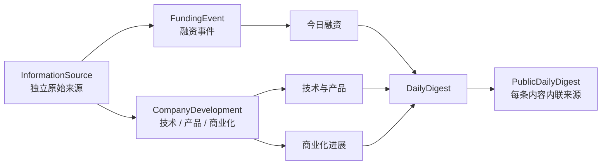

融资事件与公司动态只保存稳定来源 ID，避免同一篇官方稿在多个事件中重复登记。公开投影负责把经过允许公开的来源转换为每条内容自己的链接，因此网站没有独立来源板块，也不会要求读者离开条目寻找出处。

重要性评分属于事件或动态自身，范围固定为 1–5。日报板块默认按重要性降序；人工排序是显式覆盖，不修改内容自身的重要性评分。这样既保留机器排序依据，也保留团队最终编辑权。

允许公开且进入可发布状态的融资事件或公司动态必须至少关联一个来源。该约束在运行时 Schema 层执行，不依赖飞书页面提示。

| 文件 | 作用与边界 |
|---|---|
| `lib/domain/information-source.ts` | 独立正式来源对象；保存链接、发布主体、来源类型、等级及验证时间。 |
| `lib/domain/company-development.ts` | 技术、产品和商业化三类公司动态及其来源、重要性和发布控制。 |
| `lib/domain/funding-event.ts` | 融资事实通过 `sourceIds` 关联来源，并保存重要性评分；不再内嵌正式来源记录。 |
| `lib/domain/daily-digest.ts` | 三个固定板块的内部引用、人工顺序以及确定性排序函数。 |
| `lib/domain/public-dto.ts` | 公开融资、公司动态和三板块日报白名单；日报每条内容内联公开来源。 |
| `lib/domain/schemas/domain.ts` | 公司动态、信息来源、重要性范围及可发布内容来源要求的运行时校验。 |
| `lib/domain/schemas/boundaries.ts` | 九表记录边界和包含公司动态的公开网站导出边界。 |
| `tests/fixtures/domain.ts` | 融资、三类公司动态、独立来源和三板块日报的脱敏组合样本。 |
| `tests/schemas/domain.test.ts` | 验证动态类别、来源要求和重要性边界。 |
| `tests/domain/types.test.ts` | 验证三板块结构、默认排序、人工覆盖和逐条来源隔离。 |

### 9.14 B03 飞书客户端边界

B03 在官方飞书 Node.js SDK 外建立项目控制的窄客户端层：

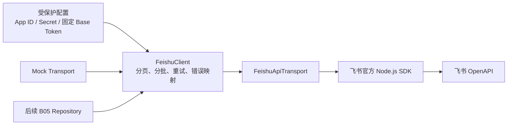

Base Token 是客户端构造配置，不是单次调用参数。调用者只能提供 table ID 和记录内容，不能通过候选文件、CLI 参数或 Provider 响应切换 Base。该限制是 B02 权限隔离测试延期期间的强制补偿控制。

客户端只处理基础设施行为：分页、500 条上限分批、受控重试和稳定错误映射。业务 ID、防重、乐观并发、字段类型和领域对象映射都不属于客户端，分别由 B04 与 B05 实现。

| 文件 | 作用与边界 |
|---|---|
| `lib/feishu/client-types.ts` | 项目级 Transport、记录、分页、批量请求、重试和脱敏日志契约；不暴露 SDK 类型。 |
| `lib/feishu/client-error.ts` | 将飞书状态码和网络异常映射为稳定、限长且不包含供应商原始消息的错误。 |
| `lib/feishu/sdk-transport.ts` | 唯一直接依赖飞书官方 SDK 的 Adapter，负责 SDK 请求和响应形状转换。 |
| `lib/feishu/client.ts` | 固定 Base、分页循环保护、批量拆分、重试策略和输入预校验。 |
| `lib/feishu/index.ts` | 飞书基础设施模块统一导出入口。 |
| `tests/feishu/client.test.ts` | 使用 Mock Transport 验证分页、分批、限流、超时、权限错误和日志脱敏，不访问真实飞书。 |
| `package.json`、`pnpm-lock.yaml` | 精确锁定飞书官方 SDK 及依赖图。 |
| `pnpm-workspace.yaml` | 显式允许 SDK 所需 `protobufjs` 构建脚本；继续拒绝未列入白名单的依赖脚本。 |

B03 冻结以下规则：

1. 领域层和 Repository 不直接导入飞书官方 SDK。
2. Base Token 只能来自受保护部署配置。
3. 权限和非法请求错误不得重试。
4. 限流、超时与临时网络错误的重试必须有次数和延迟上限。
5. 日志不得包含凭据、访问令牌或飞书返回的未经清洗错误文本。
6. 普通自动化测试必须使用 Mock Transport。

### 9.15 B04 字段 ID 映射与启动校验

B04 将可人工编辑的飞书显示名称与生产代码解耦。运行时只信任服务端配置中的 Base Token、table ID 和 field ID，并在业务读写前用飞书元数据验证这些 ID 的结构含义。

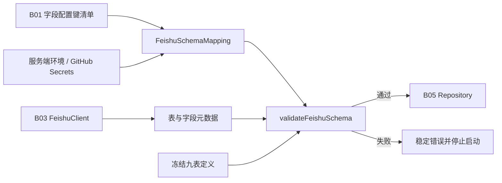

校验器不比较表名或字段显示名，因此团队可以在飞书中调整中文名称和排版。它必须比较资源 ID、字段类型、主字段、关联目标及关联多值设置；这些变化会改变读写语义，必须阻止自动化继续运行。

| 文件 | 作用与边界 |
|---|---|
| `lib/feishu/schema-mapping.ts` | 从服务端配置加载完整九表 ID 映射；缺项时只报告配置键。 |
| `lib/feishu/schema-validator.ts` | 对照冻结设计验证真实表和字段元数据，汇总稳定问题代码后失败。 |
| `lib/feishu/client-types.ts` | 增加项目级表和字段元数据类型，不向上层暴露 SDK 类型。 |
| `lib/feishu/sdk-transport.ts` | 将官方 SDK 的表、字段分页响应转换为项目元数据。 |
| `lib/feishu/client.ts` | 为表和字段元数据提供分页读取及分页循环保护。 |
| `tests/feishu/schema-validator.test.ts` | 验证配置、ID、类型、主字段、关联和显示名变更行为。 |

B04 冻结以下规则：

1. 生产读写必须在字段映射校验通过后进行。
2. 生产逻辑不得使用中文显示名定位表或字段。
3. 校验失败不得自动迁移或修复真实飞书结构。
4. 配置错误不得输出 table ID、field ID 以外的敏感配置值；默认只报告配置键和稳定问题代码。
5. 字段显示名变化不影响运行，字段语义变化必须快速失败。

### 9.16 B05 九表 Repository 与一致性规则

B05 将飞书记录 API 转换为以稳定业务 ID 为中心的数据访问层：

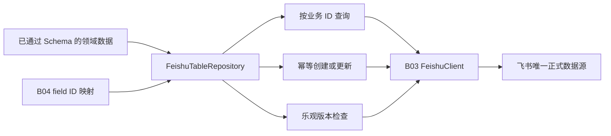

Repository 使用冻结表定义中的主字段作为稳定业务 ID。相同业务 ID 和相同内容再次写入返回 `unchanged`；内容发生变化时必须提供当前版本。创建与更新统一维护版本、创建时间和更新时间。

飞书不提供关系数据库式的原子 compare-and-swap，因此该版本机制主要防止陈旧人工或串行任务覆盖。高并发自动任务还必须使用“自动化任务”表中的任务锁，不能只依赖记录版本。

| 文件 | 作用与边界 |
|---|---|
| `lib/feishu/repository.ts` | 九表通用查询、field ID 编解码、幂等创建更新、版本与审计字段规则。 |
| `lib/feishu/index.ts` | 向 CLI、流水线和后续服务导出 Repository 契约。 |
| `tests/feishu/repository.test.ts` | 以内存 Mock 验证九表工厂、查询、创建、更新、防重、版本冲突和损坏记录。 |

B05 冻结以下规则：

1. Repository 输入必须先通过对应领域 Schema；Repository 不重新实现业务规则。
2. 每张表只能使用冻结主字段作为稳定业务 ID。
3. 相同业务 ID 不得创建第二条记录。
4. 内容变化必须经过版本检查，内容未变不得产生无意义更新。
5. 审计字段由 Repository 维护，调用者不得作为普通业务字段覆盖。
6. 普通测试不得访问真实飞书。

### 9.17 B06 项目飞书 CLI 与首次映射初始化

B06 建立管理员、Codex 和后续 GitHub Actions 共用的飞书运维入口。首批命令只执行帮助、连接检查、字段映射初始化和 Schema 检查，不提供业务记录导入或发布能力。

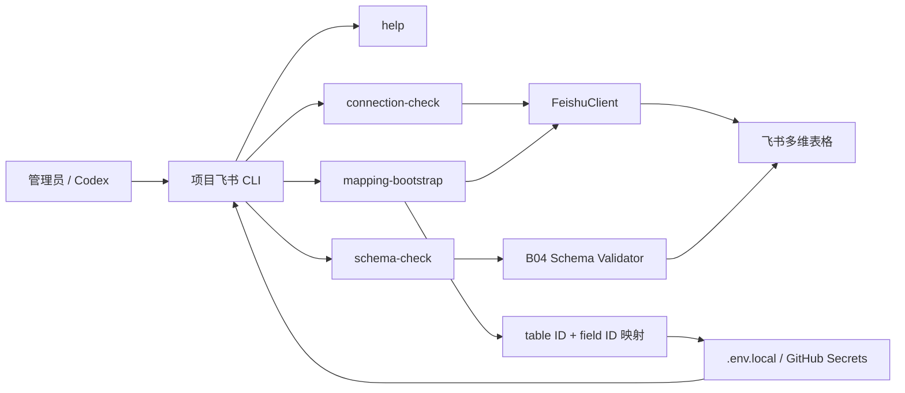

`mapping-bootstrap` 只用于首次配置或人工确认后的映射刷新。它通过允许的显示名称及明确别名唯一匹配表和字段；缺失或重名时整体停止，不产生半份配置。成功后只更新本地映射键并保留已有密钥。常规运行继续完全按 ID 工作，显示名称不进入 Repository 读写路径。

CLI 同时提供简洁文本和 `--json` 机器可读输出。错误使用稳定退出码：用法或配置错误为 2、权限错误为 3、网络或限流错误为 4、Schema 错误为 5；底层异常文本、App Secret、Token 和字段 ID 不进入错误输出。

| 文件 | 作用与边界 |
|---|---|
| `cli/index.ts` | CLI 进程入口，只负责参数转交、stdout/stderr 和退出码。 |
| `cli/app.ts` | 命令解析、帮助、文本或 JSON 响应以及实时服务组合。 |
| `cli/config.ts` | 只加载飞书 CLI 所需的 App ID、Secret 和固定 Base Token，不要求无关 Provider 配置。 |
| `cli/errors.ts` | 将客户端、配置和 Schema 异常转换为稳定、脱敏的 CLI 错误与退出码。 |
| `cli/mapping-bootstrap.ts` | 只读发现九表及契约字段 ID，执行唯一名称匹配，并原子更新本地映射配置。 |
| `tests/cli/cli.test.ts` | 验证帮助、成功摘要、JSON、权限、网络、Schema、退出码和脱敏。 |
| `tests/cli/mapping-bootstrap.test.ts` | 验证允许别名、缺表停止、配置合并和密钥保留。 |

B06 进一步冻结以下规则：

1. `help` 不加载凭据，也不构造真实飞书客户端。
2. 连接检查和 Schema 检查均为只读操作。
3. 映射初始化不得修改飞书表、字段或记录，只能更新被 Git 忽略且权限受限的本地配置。
4. 名称仅用于首次发现；生产读写和常规 Schema 校验仍只信任 table ID 与 field ID。
5. 飞书字段列表的第一页首字段统一视为主字段，避免供应商元数据标记的瞬时不一致；其余字段不得被解释为主字段。
6. 日报使用 `digestId` 作为稳定业务主键，`digestDate` 继续承担业务日期、每日唯一性和归档筛选语义。
7. 本地真实 Base 已完成 9 张表、148 个契约字段的映射初始化，并通过包含 159 个实际字段的只读 Schema 校验；额外展示和统计字段不进入 Repository 契约。

### 9.18 C01 WorkBuddy 候选文件契约

C01 将 WorkBuddy 与项目内部处理流程通过版本化 JSON 文件解耦。WorkBuddy 只负责发现国内公众号、公司、投资机构、FA 和产业媒体线索，并输出未经审核的候选；候选文件不能携带正式事件、审核结果、发布控制或内部战投字段。

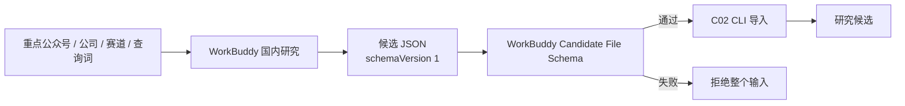

候选文件顶层只允许 `schemaVersion` 和 `candidates`。每条候选只允许标题、原始 URL、来源名称、内容类型、来源类型、来源等级、原始发布时间、命中查询词、初步摘要和发现时间。发布时间未知时使用 `null`，发现时间必须存在；所有非空时间均使用带时区的 ISO 8601。内容类型、来源类型和来源等级由 WorkBuddy 明确输出，CLI 不根据标题猜测。

| 文件 | 作用与边界 |
|---|---|
| `lib/providers/workbuddy/candidate-format.ts` | 定义格式版本、单文件候选上限、文件运行时 Schema 和推导类型；复用 A03 单条候选信任边界。 |
| `lib/providers/workbuddy/index.ts` | WorkBuddy Provider 子模块导出入口。 |
| `lib/providers/index.ts` | Provider 层统一导出入口，不向领域层引入供应商实现。 |
| `docs/workbuddy-candidate-format.md` | 面向 WorkBuddy 操作者的 JSON 示例、字段规则、搜索要求、安全限制和错误处理说明。 |
| `tests/providers/workbuddy/candidate-format.test.ts` | 验证公众号样本、必填 URL、危险 URL、摘要长度、日期、越权字段和文件数量上限。 |

C01 冻结以下规则：

1. 当前格式版本为字符串 `"1"`；格式变化必须显式升级版本，不得静默改变旧文件语义。
2. 每个文件包含 1–500 条候选；文件字节大小限制在 C02 读取文件时执行。
3. 同一来源命中多个查询词时合并 `queries`，不应复制同一 URL 候选。
4. 原始 URL 必须使用 HTTP/HTTPS，且不得包含凭据或指向本机、私网和保留地址。
5. 初步摘要最多 2000 个字符，不保存完整公众号文章或付费正文。
6. WorkBuddy 不生成候选 ID、canonical URL、正式融资事实、审核状态、发布状态或内部备注；这些职责属于 C02 及后续领域流水线。
7. WorkBuddy 当前仍是可插拔人工导出入口，不因此进入无人值守生产 SLA。

### 9.19 C02 WorkBuddy 候选导入流水线

C02 将通过 C01 Schema 的候选文件转换为飞书“研究候选”记录。该流程只创建待审核候选，不创建融资事件或公司动态，也不能设置发布状态。

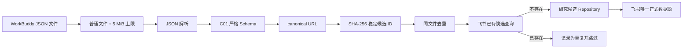

URL 规范化保留业务查询参数，移除 fragment、常见追踪参数和分享参数，并稳定排序剩余参数。候选 ID 使用 canonical URL 的 SHA-256 摘要生成，因此重复导入相同来源不会产生第二条记录。

| 文件 | 作用与边界 |
|---|---|
| `lib/providers/workbuddy/importer.ts` | 文件预检、JSON 和 Schema 校验、URL 规范化、稳定 ID、同批与已有候选去重及候选转换。 |
| `cli/app.ts` | 暴露 `workbuddy-import <file>` 命令，写入前执行真实飞书 Schema 校验并组合候选 Repository。 |
| `cli/errors.ts` | 将不可读文件、超限、非法 JSON 和候选 Schema 错误转换为稳定 `CLI_INPUT_INVALID`，只输出安全问题路径。 |
| `tests/providers/workbuddy/importer.test.ts` | 验证合法创建、URL 与 ID 稳定性、重复导入、同批去重、越权字段、非法 JSON 和文件大小。 |
| `tests/cli/cli.test.ts` | 验证导入命令参数、服务调用和机器可读计数。 |

C02 冻结以下规则：

1. 输入必须是 UTF-8 JSON 普通文件，最大 5 MiB；解析前先检查文件元数据。
2. 任一候选不符合严格 Schema 时拒绝整个文件，不进行部分写入。
3. `contentType`、`sourceType` 和 `sourceTier` 必须来自候选文件；CLI 不做基于关键词的隐式分类。
4. 导入结果固定为 `regionScope=CHINA`、`discoveredBy=WORKBUDDY` 和 `reviewStatus=PENDING`。
5. 来源名称和命中查询词以受控 JSON 保存在“初步抽取字段”，避免在当前飞书 Schema 下丢失输入证据。
6. 同一文件中的 canonical URL 重复项只保留首条；飞书中已有稳定候选 ID 时跳过，不覆盖既有候选。
7. 导入前必须执行 B04 Schema 校验；映射或真实结构错误时不得写入。
8. WorkBuddy 不能写入正式事件、公司动态、允许公开、发布状态或内部战投字段。

### 9.20 C03 OpenAI 海外研究边界

C03 把 OpenAI 分成供应商 Transport 和项目 Provider 两层。Transport 只负责调用 Responses API、Web Search 和读取模型响应；Provider 负责项目预算、超时、重试、错误脱敏与本地运行时校验。领域层不依赖 OpenAI SDK。

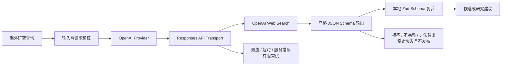

模型输出必须同时满足供应商侧严格 JSON Schema 和项目侧 Zod Schema。JSON Schema 约束模型生成的结构；Zod 是本地信任边界，不能因供应商声明成功而省略。冲突不是摘要文字，而是由字段名、至少两个不同值及各自来源 URL 组成的结构化证据。

| 文件 | 作用与边界 |
|---|---|
| `lib/providers/openai/types.ts` | 定义项目 Provider、可替换 Transport、请求、响应和安全日志事件契约。 |
| `lib/providers/openai/sdk-transport.ts` | 唯一直接依赖 OpenAI SDK 的 Adapter；调用 Responses API、Web Search 和严格结构化输出。 |
| `lib/providers/openai/provider.ts` | 执行查询长度与调用预算、超时、有限重试、响应解析和 Zod 复验。 |
| `lib/providers/openai/response-schema.ts` | 提交给 Responses API 的严格 JSON Schema；全部对象拒绝额外字段并要求声明字段。 |
| `lib/providers/openai/errors.ts` | 把网络、限流、超时、拒答和非法输出转换为稳定且脱敏的项目错误。 |
| `lib/providers/openai/index.ts` | OpenAI Provider 子模块导出入口。 |
| `lib/config/server.ts` | 读取 OpenAI 模型、请求量、输入字符、输出 Token、重试和超时配置。 |
| `tests/providers/openai/provider.test.ts` | 使用离线 Transport 验证成功和所有稳定失败路径、重试边界及日志脱敏。 |
| `tests/providers/openai/response-schema.test.ts` | 验证严格 JSON Schema 的对象封闭性、必填完整性和冲突证据约束。 |

C03 冻结以下规则：

1. 模型名称和预算只能来自服务端配置，不在 Provider 中写死生产模型。
2. 浏览器、静态网站和公开导出不能获得 OpenAI API Key 或直接调用 OpenAI。
3. OpenAI 完整请求、搜索正文和完整响应不能写入日志、Git 或公开产物。
4. 只有限流、超时和服务异常可以有限重试；非法 JSON、Schema 错误、拒答和不完整响应不重试。
5. `maxRetries` 表示首次调用之后允许的重试数，总调用次数不得超过 `maxRetries + 1`。
6. OpenAI 输出只能成为候选或建议，不能直接创建正式事件、修改内部备注或设置发布状态。
7. 自动化测试必须通过 Transport 注入离线替身，不得访问真实 OpenAI。
8. 供应商侧严格 JSON Schema 不能替代项目本地 Zod 校验。

### 9.21 C04 安全内容获取边界

C04 是所有直接网页访问的统一网络信任边界。候选 URL 通过 A03 字符串校验后，仍必须经过 C04 的 DNS、地址、重定向、超时、响应大小和内容类型检查，才能把清洗后的必要正文交给后续领域流水线。

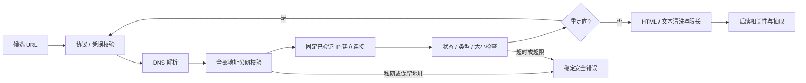

URL 字符串校验、DNS 地址校验和连接目标固定必须同时存在。只在请求前查询 DNS、随后仍按主机名重新连接，会留下 DNS rebinding 时间窗口；因此原生 Transport 直接连接通过策略检查的 IP，并使用原始 Host 和 HTTPS SNI 保持正常虚拟主机与证书验证。

| 文件 | 作用与边界 |
|---|---|
| `lib/providers/content-fetch/network-policy.ts` | 校验 URL 协议与凭据，并识别 IPv4、IPv6 和 IPv4-mapped IPv6 的非公网地址。 |
| `lib/providers/content-fetch/native-transport.ts` | 使用已验证 IP 发起原生 HTTP/HTTPS 请求，保持 Host/SNI，并在流式读取期间执行字节上限。 |
| `lib/providers/content-fetch/fetcher.ts` | 组合 DNS、统一超时、重定向复验、循环检测、状态、大小、编码和媒体类型检查。 |
| `lib/providers/content-fetch/extract.ts` | 从 HTML 或纯文本中提取限长标题与正文，移除脚本、样式、导航和控制字符。 |
| `lib/providers/content-fetch/errors.ts` | 定义不包含 URL、响应正文和底层异常的稳定安全错误。 |
| `lib/providers/content-fetch/types.ts` | 定义可替换 Resolver、固定地址 Transport、响应和清洗结果契约。 |
| `lib/providers/content-fetch/index.ts` | 安全内容获取子模块导出入口。 |
| `tests/providers/content-fetch/fetcher.test.ts` | 使用离线 Resolver 与 Transport 验证正常中英文内容及全部安全失败路径。 |

C04 冻结以下规则：

1. 所有直接网页访问必须经过 C04，不能因 URL 已通过 A03 Schema 而跳过网络层复验。
2. 任一 DNS 答案为非公网地址时拒绝整个主机，不从混合解析结果中挑选公网地址继续访问。
3. 实际连接必须固定到已经验证的地址；重定向目标必须重新解析并校验。
4. DNS、连接和正文读取必须有时间上限；响应正文必须在流式读取阶段执行大小上限。
5. 只接收明确允许的文本媒体类型；二进制和未支持的压缩格式不得交给正文抽取器。
6. 只保留后续研究必要的限长标题与正文，不保存脚本、页面 DOM、Cookie 或完整受版权保护网页。
7. 安全错误和日志不得包含完整 URL 查询参数、响应正文或底层网络异常。
8. 自动化测试必须注入离线 Resolver 与 Transport，不得访问真实外网。
9. C04 不提供登录、验证码、付费墙或反爬绕过能力。

### 9.22 C05 行业相关性判断边界

C05 位于安全内容获取之后、事实抽取之前。它只回答候选是否属于 PRD 定义的具身智能与 Physical AI 范围，并保存可复核的模型判断；它不决定正式审核、公开发布或删除候选。

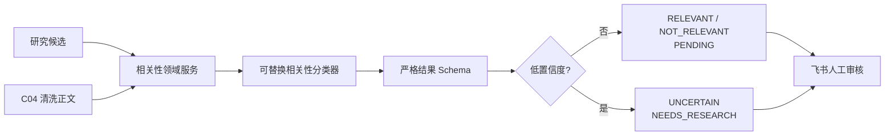

相关性决策和审核状态是不同概念。`NOT_RELEVANT` 是模型建议，不等于人工 `REJECTED`；`RELEVANT` 也不等于 `APPROVED`。只有低置信度或模型明确不确定时，系统可以把候选送入 `NEEDS_RESEARCH`，但不能自动发布或删除。

| 文件 | 作用与边界 |
|---|---|
| `lib/domain/research-candidate.ts` | 在相关性判断中保存决策、理由、置信度及实际模型名称。 |
| `lib/domain/schemas/domain.ts` | 要求已保存的候选相关性结果必须包含合法、限长的模型名称。 |
| `lib/pipeline/relevance/types.ts` | 定义分类器输入、输出、候选处理输入和可替换分类器接口。 |
| `lib/pipeline/relevance/service.ts` | 校验候选与分类结果、执行低置信度降级、保护重复状态并生成新的候选状态。 |
| `lib/pipeline/relevance/openai-classifier.ts` | 将 PRD 行业范围、排除规则、来源和 C04 清洗正文交给 C03 OpenAI Provider。 |
| `lib/pipeline/relevance/errors.ts` | 定义输入、分类输出和供应商失败的稳定脱敏错误。 |
| `lib/pipeline/relevance/index.ts` | 相关性子模块导出入口。 |
| `lib/pipeline/index.ts` | 领域流水线统一导出入口。 |
| `tests/pipeline/relevance/service.test.ts` | 使用离线分类器验证明确相关、明确无关、边界、低置信度、重复保护、Schema 和错误脱敏。 |

C05 冻结以下规则：

1. 相关性分类必须同时接收候选元数据和 C04 已清洗、限长正文，不能直接信任未清洗 HTML。
2. 分类范围必须遵守 PRD；证据不足或只有间接关联时返回 `UNCERTAIN`。
3. 每个已保存判断必须包含决策、理由、置信度和实际模型名称。
4. LOW 等级或低于配置阈值的结果必须降级为 `UNCERTAIN + NEEDS_RESEARCH`。
5. `RELEVANT` 和 `NOT_RELEVANT` 只作为模型建议保持待审核，不能自动转换为人工批准或拒绝。
6. 相关性服务不得设置发布状态、正式事件状态或内部战投字段。
7. 已有 `DUPLICATE` 状态不得被相关性判断覆盖。
8. 分类器响应是外部不可信输入，必须经过本地严格 Schema；底层错误和完整模型响应不得进入日志或错误。
9. 测试必须使用离线分类器或 Mock OpenAI，不得访问真实模型。

### 9.23 C06 融资事实与证据边界

C06 只处理 C05 明确相关的候选，将 C04 清洗正文和 C03 结构化研究结果转换为有来源约束的融资事实。模型输出的字段值本身不构成证据；只有被至少一个来源通过 `supportsFacts` 明确支持的字段才能保留。

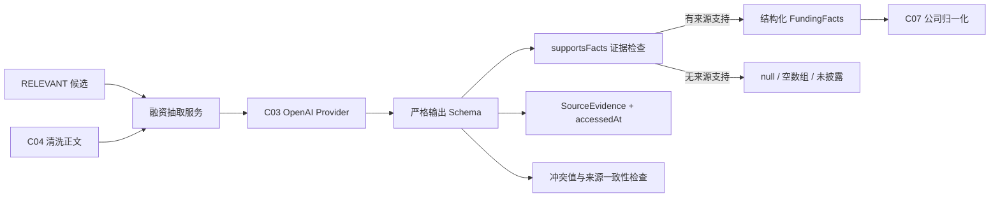

来源证据与事实采用逐字段关系，而不是“页面被列为来源就默认支持全部结论”。例如，一个来源只披露公司和融资轮次时，不能被用来证明金额或投资方。金额是复合不变量：只有金额和币种均存在且均有证据时，才允许 `amountDisclosed=true`。

| 文件 | 作用与边界 |
|---|---|
| `lib/domain/schemas/boundaries.ts` | 要求 OpenAI 每个来源提供 1–9 个合法 `supportsFacts` 字段。 |
| `lib/providers/openai/response-schema.ts` | 在供应商严格 JSON Schema 中同步来源事实映射，保持全部字段必填和对象封闭。 |
| `lib/providers/openai/sdk-transport.ts` | 指示模型只标记来源实际陈述的字段，不能把未陈述事实算作证据。 |
| `lib/pipeline/funding-extraction/types.ts` | 定义抽取 Provider、输入以及包含候选、事实、证据、冲突和模型的结果。 |
| `lib/pipeline/funding-extraction/service.ts` | 执行相关性门禁、反幻觉请求、结果 Schema、事实证据收敛、冲突来源校验和候选更新。 |
| `lib/pipeline/funding-extraction/errors.ts` | 定义输入、输出和 Provider 失败的稳定脱敏错误。 |
| `lib/pipeline/funding-extraction/index.ts` | 融资抽取子模块导出入口。 |
| `tests/pipeline/funding-extraction/service.test.ts` | 离线验证已披露、未披露、多币种、多投资方、模糊日期、证据缺失、冲突和错误脱敏。 |

C06 冻结以下规则：

1. 只有相关性为 `RELEVANT` 的候选可以进入自动融资字段抽取；不确定候选必须先补充研究或人工确认。
2. 未披露金额不得估算；`amountDisclosed=false` 时金额和币种必须同时为 `null`。
3. 模糊日期不得转换为猜测的具体日期；未披露投资方不得使用推测名称。
4. 每个 OpenAI 来源必须通过 `supportsFacts` 声明其实际支持字段，不能默认一个来源支持全部结果。
5. 没有来源支持的模型字段必须清空为未知值，而不是进入候选事实。
6. 已披露金额只有在金额、币种和值本身均完整且有证据时才成立。
7. 冲突中的每个值必须引用已知来源，且来源必须声明支持对应冲突字段。
8. 抽取结果必须记录模型名称和来源访问时间；Provider 完整响应不得写入日志或正式数据。
9. C06 返回的来源证据必须在后续持久化中进入“信息来源”表并被正式事件关联，不能只保留摘要文本。
10. 测试必须使用 Mock Provider 和固定时钟，不得调用真实 OpenAI 或外网。

### 9.24 C07 公司身份归一化边界

C07 把抽取出的公司名称映射到飞书“公司”表中的稳定公司 ID。身份确认只允许依赖唯一的精确中英文名、已维护别名或官网域名；字符串相似度只能生成供人工确认的建议。

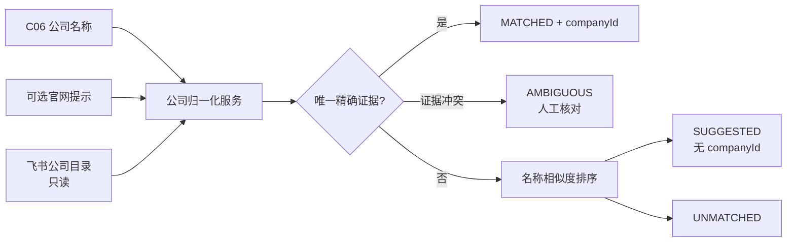

精确匹配和模糊建议使用不同的名称归一化强度。精确匹配只统一 Unicode、大小写和空白，保留内部标点；模糊建议可以忽略标点计算相似度，但永远不能据此自动返回公司 ID。

| 文件 | 作用与边界 |
|---|---|
| `lib/pipeline/company-resolution/types.ts` | 定义公司目录、匹配输入、精确依据、建议和四种结果状态。 |
| `lib/pipeline/company-resolution/service.ts` | 校验公司目录，执行保守精确匹配、域名匹配、证据冲突检测和模糊建议排序。 |
| `lib/pipeline/company-resolution/feishu-directory.ts` | 将飞书公司 Repository 的只读记录转换为公司目录，不执行写入。 |
| `lib/pipeline/company-resolution/errors.ts` | 定义输入和公司目录不合法的稳定错误。 |
| `lib/pipeline/company-resolution/index.ts` | 公司归一化子模块导出入口。 |
| `tests/pipeline/company-resolution/service.test.ts` | 验证中英文名、别名、官网、模糊名称、相似公司、标点差异、冲突和只读飞书 Adapter。 |

C07 冻结以下规则：

1. 只有唯一精确中英文名、已维护别名或官网域名可以产生 `MATCHED + companyId`。
2. 模糊字符串相似度只能产生 `SUGGESTED`，不得自动合并、更新别名或返回确认公司 ID。
3. 名称、别名或域名证据指向多个公司时必须返回 `AMBIGUOUS`，不得选择最高分记录。
4. 精确名称归一化不得删除内部标点，避免把相似但不同的品牌或型号自动合并。
5. 公司目录记录必须通过 Company Schema；候选提供的官网提示必须通过安全公开 URL Schema。
6. C07 对飞书公司目录只读，不创建新公司、不修改别名，也不执行真实合并。
7. 后续事件去重只能使用 `MATCHED` 的标准公司 ID；`SUGGESTED`、`AMBIGUOUS` 和 `UNMATCHED` 必须保留人工处理。
8. 测试必须使用内存目录或 Mock Repository，不得修改真实飞书公司表。

### 9.25 C08 事件身份与冲突边界

C08 在公司身份已由 C07 确认后判断融资候选是否属于已有事件。canonical URL 是强重复信号；事件级判断只在相同标准公司 ID 内比较日期、轮次和金额，避免跨公司误合并。

```mermaid
flowchart LR
    Input["候选 + 公司 ID + 事实 + 来源"] --> Existing{"相同候选 ID?"}
    Existing -->|是| Rerun["EXISTING"]
    Existing -->|否| URL{"canonical URL 相同?"}
    URL -->|是| URLDup["URL_DUPLICATE"]
    URL -->|否| Company["相同标准公司 ID"]
    Company --> Signals["日期 / 轮次 / 金额信号"]
    Signals -->|至少两个一致| EventDup["EVENT_DUPLICATE"]
    Signals -->|同日期但事实冲突| Conflict["CONFLICT + NEEDS_RESEARCH"]
    Signals -->|不足以确认| New["NEW"]
    URLDup --> Merge["合并全部来源"]
    EventDup --> Merge
    Conflict --> Merge
```

重复与冲突不是互斥的文本标签，而是带身份和证据的数据状态。重复候选通过 `duplicateOf` 指向已有候选；冲突记录每个字段的不同值和对应来源，人工复核前不得选择胜出事实。

| 文件 | 作用与边界 |
|---|---|
| `lib/pipeline/event-deduplication/types.ts` | 定义已处理候选目录、去重输入和五种确定性结果状态。 |
| `lib/pipeline/event-deduplication/service.ts` | 校验输入与历史目录，执行候选 ID、URL、公司及事件信号比较，合并来源并生成冲突。 |
| `lib/pipeline/event-deduplication/errors.ts` | 定义不暴露底层记录内容的稳定输入错误。 |
| `lib/pipeline/event-deduplication/index.ts` | 事件去重子模块导出入口。 |
| `tests/pipeline/event-deduplication/service.test.ts` | 验证 URL 重复、事件转载、多轮融资、事实冲突、重跑、跨公司隔离和历史数据校验。 |

C08 冻结以下规则：

1. 相同候选 ID 重跑必须返回已有结果，不得创建第二条候选。
2. 相同 canonical URL 是强重复信号，但重复结果仍需保留新来源证据。
3. 事件级自动去重只能在相同的 C07 标准公司 ID 内执行。
4. 日期、轮次和金额中至少两个强信号一致，才允许在不同 URL 间自动判断为同一事件。
5. 同公司后续不同日期、轮次和金额的融资不得合并。
6. 同日期事件出现轮次、金额、币种或日期冲突时必须进入 `NEEDS_RESEARCH`，不能静默覆盖。
7. 每个冲突值必须携带自己的来源 URL；重复报道的全部来源必须合并保留。
8. `SUGGESTED`、`AMBIGUOUS` 或 `UNMATCHED` 公司结果不得进入自动事件级合并。
9. 新输入和飞书历史目录都属于运行时不可信数据，必须在比较前通过 Schema。
10. C08 不直接发布、创建正式融资事件或修改内部战投判断。

### 9.26 C09 置信度与摘要证据边界

C09 是候选处理阶段的最后一道证据门禁。它不再调用模型补充事实，而是基于已通过 C06 证据收敛和 C08 冲突处理的数据，确定性计算置信度并生成逐句可追溯摘要。

```mermaid
flowchart LR
    Facts["C06 FundingFacts"] --> Score["确定性置信度评分"]
    Evidence["去重来源证据"] --> Score
    Access["C04 可访问来源"] --> Score
    Conflicts["C08 冲突"] --> Score
    Score --> Level["HIGH / MEDIUM / LOW"]
    Level --> Review["PENDING / NEEDS_RESEARCH / DUPLICATE"]

    Facts --> Claims["确定性事实句"]
    Evidence --> Claims
    Conflicts -->|排除冲突字段| Claims
    Claims --> Summary["公开摘要草稿 + 字段 + 来源 URL"]
```

摘要不是一段无法审计的自由文本。每条 claim 明确列出所用事实字段和支持来源 URL；任何字段缺少来源、来源不可追踪或处于冲突状态时，都不能作为确定事实进入摘要。

| 文件 | 作用与边界 |
|---|---|
| `lib/pipeline/confidence-summary/types.ts` | 定义评分输入、逐句 claim、摘要结果和可观测指标。 |
| `lib/pipeline/confidence-summary/service.ts` | 去重来源、计算质量/数量/覆盖/可访问/冲突评分，更新候选置信度并生成可追溯摘要。 |
| `lib/pipeline/confidence-summary/errors.ts` | 定义不暴露候选或来源正文的稳定输入错误。 |
| `lib/pipeline/confidence-summary/index.ts` | 置信度与摘要子模块导出入口。 |
| `tests/pipeline/confidence-summary/service.test.ts` | 验证高、中、低样本、权威来源单调性、重复来源、冲突降级和逐句证据追踪。 |

C09 冻结以下规则：

1. 置信度必须由来源等级、去重数量、事实覆盖、原文可访问性和冲突共同决定，不能只使用模型自报分数。
2. 增加一个支持事实的权威来源不得降低评分。
3. 相同来源 URL 只能计数一次；重复证据合并支持字段并保留较高等级和较新访问时间。
4. 只有 LEAD、全部原文不可访问或事实覆盖不足一半时必须保持 LOW。
5. 任何事实冲突都必须限制为非 HIGH 并进入 `NEEDS_RESEARCH`。
6. LOW 候选不能自动丢弃或发布；`DUPLICATE` 状态不能被评分覆盖。
7. 摘要只能包含有来源支持且不处于冲突状态的事实。
8. 每个摘要 claim 必须记录事实字段和来源 URL，不能只提供无法逐句核验的完整段落。
9. C09 不生成投资建议、估值结论或来源中不存在的市场事实。
10. 测试必须使用固定证据和可访问 URL，不调用真实 OpenAI、外网或生产飞书。

### 9.27 阶段 C 已落地的候选处理链路

```mermaid
flowchart LR
    Discover["C01-C03 国内外候选"] --> Fetch["C04 安全正文"]
    Fetch --> Relevant["C05 行业相关性"]
    Relevant --> Extract["C06 融资事实与证据"]
    Extract --> Company["C07 公司归一化"]
    Company --> Dedup["C08 事件去重与冲突"]
    Dedup --> Confidence["C09 置信度与摘要"]
    Confidence --> Review["阶段 D 飞书人工审核"]
```

阶段 C 的所有外部输入都经过运行时 Schema，且任何 Agent 输出都只能形成候选或建议。正式融资事件、允许公开和日报发布仍属于后续人工审核与发布流水线。

### 9.28 D01 飞书候选审核视图

研究候选只保存在一张飞书“研究候选”表中。“全部研究候选”“今日待审核”“高置信度”“低置信度”“待复核”和“重复候选”是同一批记录的不同筛选视图，不是六份数据副本。候选写入一次后，由发现时间、置信度和审核状态自动进入相应视图。

```mermaid
flowchart LR
    Candidate["研究候选表<br/>唯一候选记录"] --> All["全部研究候选"]
    Candidate --> Today["今日待审核<br/>今天 + PENDING"]
    Candidate --> High["高置信度<br/>HIGH + PENDING"]
    Candidate --> Low["低置信度<br/>LOW"]
    Candidate --> Research["待复核<br/>NEEDS_RESEARCH"]
    Candidate --> Duplicate["重复候选<br/>DUPLICATE"]
```

每个审核视图必须保留候选 ID、标题、原始来源 URL、来源等级、冲突提示和审核状态等核验字段，并隐藏规范 URL、初步抽取 JSON、版本和审计字段等系统载荷。当前飞书表把“相关性”设为界面主字段，飞书不允许隐藏主字段，因此各视图会额外显示“相关性”；领域业务主键仍然是稳定的候选 ID。

| 文件 | 作用与边界 |
|---|---|
| `lib/feishu/schema-definition.ts` | 定义五个候选审核视图的名称、显示列、筛选条件和排序设计，是视图的机器可读工程契约。 |
| `tests/feishu/schema-definition.test.ts` | 离线验证候选按日期、置信度和审核状态进入正确视图，并防止系统载荷列进入审核视图。 |
| `docs/feishu-schema.md` | 面向人工维护者说明飞书视图的筛选、显示列、排序和主字段限制。 |
| `progress.md` | 记录 D01 的真实飞书配置、自动化测试、人工验收和后续限制，不承担运行时配置。 |

D01 冻结以下规则：

1. 多个视图不得复制候选记录，也不得成为独立正式数据源。
2. 空视图只表示当前没有满足筛选条件的候选，不表示配置失败。
3. 所有状态分流以飞书正式字段值为准；候选不得为了进入视图而重复写入。
4. 审核者必须能从视图直接打开原始来源并看到来源等级与冲突提示。
5. 系统载荷和审计字段不得成为候选审核视图的常规展示列。
6. 自动化测试验证分流逻辑；真实候选导入后还必须通过实际记录验证飞书端分流。

### 9.29 D02 审核转正式融资事件

D02 是候选层与正式数据层之间的人工授权边界。只有飞书审核状态为 `APPROVED` 的候选可以进入转换；其他四种状态必须无写入地跳过。转换成功只创建不公开的 `DRAFT` 正式事件，候选批准不等于网站发布批准。

```mermaid
flowchart LR
    Candidate["研究候选"] --> Status{"审核状态"}
    Status -->|APPROVED| Validate["校验公司、事实、来源、摘要与评分"]
    Status -->|PENDING / REJECTED / NEEDS_RESEARCH / DUPLICATE| Skip["SKIPPED<br/>不写正式事件"]
    Validate --> EventId["由 candidateId 生成稳定 eventId"]
    EventId --> Store["飞书正式融资事件"]
    Store --> Draft["DRAFT + isPublic=false"]
    Store -->|相同 eventId 与相同内容重跑| Existing["EXISTING"]
```

正式事件引用公司和信息来源时，领域层使用稳定业务 ID；飞书 Adapter 在写入前将业务 ID 解析为飞书记录 ID。这样领域服务不依赖飞书关系字段格式，同时避免把公司名称或 URL 文本误当成正式关联。

| 文件 | 作用与边界 |
|---|---|
| `lib/pipeline/candidate-review/types.ts` | 定义人工批准补充字段、正式事件存储端口和转换结果；不包含飞书 SDK 类型。 |
| `lib/pipeline/candidate-review/service.ts` | 校验五种审核状态，构造确定性事件 ID，并将批准候选转换为不公开草稿。 |
| `lib/pipeline/candidate-review/feishu-store.ts` | 将公司和来源业务 ID 解析为飞书记录关联，并通过 B05 Repository 幂等写入正式事件。 |
| `lib/pipeline/candidate-review/errors.ts` | 定义无敏感数据的稳定输入不完整和事件变更错误。 |
| `tests/pipeline/candidate-review/service.test.ts` | 验证五种审核状态、必要字段、非公开草稿和重复执行幂等。 |
| `tests/pipeline/candidate-review/feishu-store.test.ts` | 验证飞书关系解析、重复写入映射和禁止覆盖正式事件。 |

D02 冻结以下规则：

1. 只有人工 `APPROVED` 候选可以创建正式融资事件。
2. `PENDING`、`REJECTED`、`NEEDS_RESEARCH` 和 `DUPLICATE` 不得调用正式事件存储。
3. 候选批准只产生 `DRAFT + isPublic=false`；后续公开必须经过独立发布控制。
4. 审核通过候选必须具备已确认公司、融资日期、地区、至少一个来源、置信度、公开摘要和重要性字段，否则拒绝转换。
5. 事件 ID 必须从候选 ID 确定性生成；相同候选重跑返回同一事件，不得创建第二条。
6. 重跑不得利用审核转换隐式修改既有正式事件；内容变化必须进入显式人工修改流程。
7. 公司和来源关联必须通过稳定业务 ID 查找飞书记录 ID，不能根据名称或 URL 猜测关联。
8. D02 自动化测试不得访问生产飞书；真实写入只在具备完整审核数据后通过统一流水线触发。

### 9.30 D03 每日日报草稿生成

D03 从飞书正式融资事件与公司动态生成单个 Asia/Shanghai 业务日期的内部日报草稿。日报生成只组织已经进入正式表的数据，不读取研究候选，也不决定内容是否允许公开。

```mermaid
flowchart LR
    Clock["固定或系统时钟"] --> Date["Asia/Shanghai 业务日期"]
    Funding["正式融资事件"] --> Select["当天且非 WITHDRAWN"]
    Development["正式公司动态"] --> Select
    Select --> F["今日融资"]
    Select --> TP["技术与产品"]
    Select --> C["商业化进展"]
    F --> Sort["重要性降序<br/>同分稳定 ID"]
    TP --> Sort
    C --> Sort
    Sort --> Digest["唯一日报草稿<br/>PENDING + DRAFT"]
```

技术与产品板块合并 `TECHNOLOGY` 和 `PRODUCT` 公司动态，商业化板块只接收 `COMMERCIALIZATION`。三个板块分别从 1 开始生成排名；即使全部板块为空，也要保存当天唯一空日报，以区分“任务成功但无内容”和“任务没有运行”。

| 文件 | 作用与边界 |
|---|---|
| `lib/pipeline/daily-digest/types.ts` | 定义日报所需的最小正式内容投影、内容源端口、日报存储端口和生成结果。 |
| `lib/pipeline/daily-digest/service.ts` | 计算上海业务日期，筛选当天非撤回内容，生成三板块稳定排序和唯一日报草稿。 |
| `lib/pipeline/daily-digest/feishu-store.ts` | 将事件和动态业务 ID 解析为飞书记录关联，并通过 B05 Repository 幂等保存日报。 |
| `lib/pipeline/daily-digest/errors.ts` | 定义非法正式内容和禁止覆盖既有日报的稳定错误。 |
| `tests/pipeline/daily-digest/service.test.ts` | 验证上海日期边界、三板块、排序、撤回过滤、空日报和同日重跑。 |
| `tests/pipeline/daily-digest/feishu-store.test.ts` | 验证日报关系解析、空关系、重复结果和禁止静默覆盖。 |

D03 冻结以下规则：

1. 日报日期必须按 `Asia/Shanghai` 计算，不能使用 Runner 本地时区或 UTC 日期代替。
2. 只选择业务日期等于日报日期且发布状态不是 `WITHDRAWN` 的正式事件和公司动态。
3. `TECHNOLOGY` 与 `PRODUCT` 进入“技术与产品”；`COMMERCIALIZATION` 进入“商业化进展”。
4. 每个板块默认按重要性评分降序；同分时按稳定业务 ID 排序，确保相同快照产生相同结果。
5. 初始 `sectionOrder` 必须明确记录三个板块各自从 1 开始的顺序，后续人工排序优先。
6. 没有内容时仍生成合法空日报，不把空结果误判为任务失败。
7. 日报 ID 固定为 `digest-YYYY-MM-DD`；同一业务日期重跑返回既有日报，不创建第二条。
8. 自动生成的日报固定为 `PENDING + DRAFT`、`autoPublished=false`，不得自动公开。
9. 日报生成不得静默覆盖已经存在但内容不同的日报；内容更新需要后续显式审核或更新流程。
10. D03 测试不得访问生产飞书，真实写入留给完整流水线验收。

### 9.31 D04 飞书个人文本通知

D04 的 MVP 通知目标是一个明确配置的个人飞书用户，不是群聊。生产配置只接受用户 `open_id`，SDK Adapter 将 `receive_id_type` 固定为 `open_id`；业务层和调用方不能传入 `chat_id` 或切换到群发。

```mermaid
flowchart LR
    Review["审核提醒"] --> Template["纯文本模板"]
    Publish["日报通知"] --> Template
    Failure["任务失败"] --> Template
    Recovery["任务恢复"] --> Template
    Template --> Provider["FeishuNotificationProvider"]
    Provider --> Direct["指定个人 open_id"]
    Group["群聊 chat_id"] -.拒绝.-> Provider
```

通知是正式数据处理完成后的旁路副作用。发送失败只能返回可重试错误，不能回滚、改变或重新发布飞书正式数据。每类消息使用业务日期组成幂等键，消息内容只包含必要计数、简短状态和普通 HTTPS 链接，不生成消息卡片。

个人收件人标识必须由当前项目自建应用通过飞书通讯录接口解析。由于 `open_id` 是用户在单个应用内的身份标识，不能从其他飞书应用复制替代；本地开发值只保存在被 Git 忽略的 `.env.local`，无人值守生产值必须迁移到公司 GitHub Secrets 或受保护环境。2026-08-03 已使用当前应用和配置的个人 `open_id` 完成一次真实私聊验收：飞书 API 确认送达且用户本人确认收到，未向群聊发送，也未触碰多维表格正式数据。

| 文件 | 作用与边界 |
|---|---|
| `lib/providers/notification/types.ts` | 定义四类消息输入、私聊发送端口和送达结果，不暴露群聊收件人类型。 |
| `lib/providers/notification/service.ts` | 校验输入并生成审核、日报、失败和恢复四类纯文本内容及稳定幂等键。 |
| `lib/providers/notification/provider.ts` | 绑定单个个人 `open_id`，校验文本和幂等键，并将供应商错误转换为脱敏稳定错误。 |
| `lib/providers/notification/sdk-transport.ts` | 调用飞书消息 API，固定 `receive_id_type=open_id` 和 `msg_type=text`。 |
| `lib/config/server.ts` | 仅从服务端环境读取 `FEISHU_NOTIFICATION_RECIPIENT_OPEN_ID`；旧群聊配置不能满足生产校验。 |
| `tests/providers/notification/` | 验证四类文案、普通链接、个人收件人、群聊拒绝、错误脱敏和通知失败不改变正式状态。 |

D04 冻结以下规则：

1. MVP 通知只发送给配置的个人飞书用户，不发送到群聊。
2. 生产配置使用 `FEISHU_NOTIFICATION_RECIPIENT_OPEN_ID`；不得使用 `chat_id` 作为替代。
3. SDK 调用固定为 `receive_id_type=open_id`、`msg_type=text`，不生成消息卡片或交互式载荷。
4. 审核提醒包含候选总数、高低置信度、待复核数量和飞书审核链接。
5. 日报通知包含融资事件数、简短头条、日报链接和是否经过人工审核。
6. 失败与恢复通知只包含任务名、稳定错误代码和普通操作链接，不泄露底层异常或密钥。
7. 通知失败不得改变正式事件、日报、发布状态或网站版本。
8. 自动化测试必须使用 Mock Transport，不向真实用户或群聊发送消息。
9. `open_id` 必须由当前飞书自建应用解析并定向绑定；本地 `.env.local` 只用于开发验收，生产自动化不得依赖个人电脑保存该值。

### 9.32 D05.1 指定日期海外候选发现入口

D05.1 把 OpenAI 海外研究接入现有候选边界，但不跨越人工审核边界。CLI 接收明确的 Asia/Shanghai 业务日期和版本化查询矩阵，每个查询最多产生一个经过 C03 严格 Schema 校验的融资研究结果。只有存在明确发布时间且换算到上海时区后等于指定日期的一手、权威或二手原始来源，结果才有资格创建候选。

```mermaid
flowchart LR
    Date["业务日期 + 查询矩阵"] --> OpenAI["OpenAI 海外研究"]
    OpenAI --> Schema["C03 严格 Schema"]
    Schema --> Gate{"日期与来源门禁"}
    Gate -->|"日期不符 / LEAD / 搜索摘要"| Reject["拒绝，不写入"]
    Gate -->|"合格原始来源"| Canonical["URL 规范化与幂等检查"]
    Canonical -->|"已存在"| Duplicate["重复计数，不覆盖"]
    Canonical -->|"新候选"| Candidate["研究候选<br/>OVERSEAS + OPENAI + FUNDING + PENDING"]
    Candidate --> Review["飞书人工审核"]
```

海外发现模块只能持有“研究候选”Repository 端口，不能访问融资事件、公司动态、日报或发布 Repository。这个类型边界与运行时固定字段共同保证外部 Agent 的结果即使通过 Schema，也仍然只是待人工核验的候选。

飞书 Repository 负责领域时间与供应商字段格式之间的统一转换。领域对象中的 `date` 使用 `YYYY-MM-DD` 上海业务日期，`dateTime` 使用 ISO 8601 时间；写入飞书时二者均转换为毫秒时间戳，读取时分别恢复为上海日期和 UTC ISO 时间。Mock Repository 也必须观察实际发往飞书客户端的字段值，避免只在领域层断言字符串而漏掉真实 API 格式错误。

| 文件 | 作用与边界 |
|---|---|
| `lib/pipeline/overseas-discovery/query-file.ts` | 读取大小受限、版本固定、查询 ID 唯一的海外发现查询文件。 |
| `lib/pipeline/overseas-discovery/service.ts` | 构造日期约束研究任务，执行来源日期门禁、URL 幂等检查并创建待审核海外融资候选。 |
| `lib/pipeline/overseas-discovery/types.ts` | 将服务依赖限制为 OpenAI 研究 Provider 和候选 Repository，不暴露正式表写入端口。 |
| `cli/app.ts` | 提供 `openai-discover` 人工与自动化统一入口，写入前先验证真实飞书 Schema。 |
| `lib/feishu/repository.ts` | 统一字段 ID 映射、乐观并发，以及飞书日期毫秒时间戳的双向转换。 |
| `docs/pilot/d05-overseas-queries-2026-08-02.json` | 首次海外试跑查询矩阵；业务日期由 CLI 参数控制，不能在实现中写死。 |
| `docs/pilot/d05-workbuddy-2026-08-02.md` | 国内同日候选交接边界，要求 WorkBuddy 输出 C01 JSON 后由 C02 导入。 |
| `tests/pipeline/overseas-discovery/` | 验证日期门禁、来源门禁、幂等、失败语义与查询文件安全约束，全程使用 Mock。 |

D05.1 冻结以下规则：

1. 业务日期必须由调用方显式传入并按 `Asia/Shanghai` 判定，自动化实现不得写死首跑日期。
2. 日期不明确或不属于指定日期的结果不得用来填充候选数量。
3. `SEARCH_SNIPPET` 和 `LEAD` 只能作为线索，不能单独支撑候选写入。
4. 海外入口当前只创建 C03 支持的融资候选；扩展其他内容类型前必须先建立对应严格 Schema。
5. 所有新候选固定为 `OVERSEAS + OPENAI + PENDING`，候选批准、正式转换和发布是后续独立步骤。
6. 相同规范 URL 在同一 Provider、跨查询或重跑时只保留一条候选，不得覆盖人工已修改记录。
7. 单个查询失败不得阻断其他查询；全部查询失败必须以可重试失败结束，不能报告假成功。
8. CLI 和日志只能输出安全计数及稳定错误码，不能输出密钥、完整模型响应或完整网页正文。
9. 飞书 `date` 与 `dateTime` 写入值必须是毫秒时间戳；领域层不得直接依赖供应商时间格式。
10. 自动化测试不得访问真实 OpenAI、WorkBuddy 或生产飞书；真实试跑必须在离线测试经用户验收后单独授权执行。

## 10. 明确排除

MVP 架构不包含：

- 独立数据库和 ORM
- 独立管理后台
- Cloudflare
- Vercel
- 常在线个人电脑
- Obsidian
- Coze
- 飞书消息卡片
- 微信登录自动化和反爬绕过
- 用户账号、评论、收藏和 CRM

## 11. 架构不变量

后续实现不得破坏以下不变量：

1. 飞书多维表格始终是唯一正式数据源。
2. WorkBuddy 和 OpenAI只能产生候选或建议。
3. 内部数据必须在公开投影前被隔离。
4. 网站必须能够从飞书正式数据重新生成。
5. 自动任务不得依赖个人电脑或交互式 Codex 会话。
6. GitHub Pages只托管静态公开产物。
7. 所有生产资源必须归公司并可交接。

## 12. 开发 Agent 控制面

开发协作采用一个主 Agent 和六个专职子 Agent，它们是工程控制面，不是生产数据流的一部分：

```mermaid
flowchart TB
    Lead["主 Agent<br/>任务分解、契约和集成"]
    Dev["代码开发 Agent"]
    Git["Git 管理 Agent"]
    Search["每日搜索管理 Agent"]
    QA1["测试 A<br/>契约与集成"]
    QA2["测试 B<br/>E2E、安全与可靠性"]
    UI["UI 设计 Agent"]
    Lead --> Dev
    Lead --> Git
    Lead --> Search
    Lead --> QA1
    Lead --> QA2
    Lead --> UI
    Dev --> QA1
    Dev --> QA2
    UI --> Dev
    QA1 --> Lead
    QA2 --> Lead
    Git --> Lead
```

主 Agent 是唯一调度和最终集成负责人；代码开发 Agent 是唯一默认业务代码实现者；Git 管理 Agent 是唯一默认交付操作者；每日搜索管理 Agent 只能产生候选或建议；两个测试 Agent 保持独立验收视角；UI Agent 维护设计契约和视觉验收。详细权限、文件所有权和交接模板以 `agent-coordination.md` 为准。
